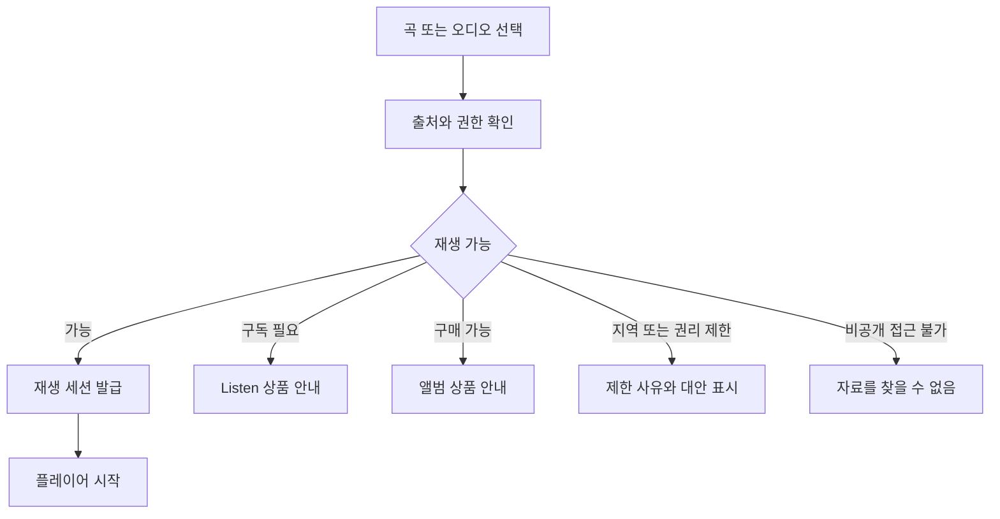

# 음원 오디오 플랫폼 UX와 정보 구조

이 문서는 핵심 화면과 사용자 흐름을 정의합니다. 실제 화면 디자인과 사용자 테스트는 후속 작업입니다. 화면의 상태는 [03](03-functional-spec.md), API는 [07](07-api-draft.md)에 연결하십시오.

## 정보 구조

| 최상위 영역 | 하위 화면 | 핵심 행동 |
|---|---|---|
| Listen | 홈, 앨범, 아티스트, 큐레이터, 대기열 | 발견·재생·저장 |
| Archive | 전체, Purchased, Private Audio, Audio Log, 기억, 여행 | 보관·검색·내보내기 |
| Collect | Physical, Digital, 판본 상세, 증빙 | 등록·정정·계약형 Upgrade |
| Atlas | 지역 선택, 지도·목록, 차트, 시대, 장소 이야기 | 지역 음악 탐험 |
| Studio | 프로젝트, 업로드, 버전, 릴리스, 분석, 판매·정산 | 제작·공개·판매 |
| Settings | 구독, 저장 용량, AI 정책, 위치, 보안, 데이터 | 동의·결제·삭제 관리 |

작은 화면에서는 Listen/Archive/Atlas/Studio를 주 탐색으로 두고 Collect는 Archive 안에 배치하는 안을 검증하십시오. 지속 플레이어는 모든 영역에 유지하되 녹음 중에는 충돌을 방지합니다. 권한과 출처는 곡 상세와 재생 화면에서 확인하실 수 있도록 합니다.

## 가입과 활성화

가입 → 계정 검증 → 무료 계정 생성 → 직접 녹음/파일 업로드/허가된 미리듣기 중 선택 → Archive 첫 항목 저장으로 이어집니다. 위치·마이크·전사 동의를 가입 필수로 묶지 않습니다. 유료 상품을 선택하면 가격·갱신일·해지·지역 제한을 먼저 보여줍니다.

## 재생 권한 흐름

비공개 자료의 타 계정 접근에서는 제목이나 소유자를 노출하지 않습니다. 이미 구매한 앨범에는 구독 가입을 필수 단계로 넣지 않습니다. 대기열에서 재생 불가 곡을 자동 건너뛰면 이유와 원래 위치를 유지합니다.

## 앨범 구매

앨범 상세 → 판본·트랙·품질·다운로드 조건 확인 → 가격·세금·통화·판매자 및 환불 조건 → 결제 → 확인 중 → 결제 확정 → Purchased 표시 → 재생 또는 다운로드입니다. 확인 중 앱을 닫아도 주문 화면에서 이어집니다. 웹훅 지연 때 재결제를 유도하지 않습니다. 동일 상품을 가진 사용자는 중복 구매 전에 확인하실 수 있도록 합니다.

구독 해지 화면은 카탈로그 이용 종료일, 구매 앨범 유지, 개인 저장 용량 변경과 내보내기 안내를 구분합니다. 구매 보장과 서비스 종료 시 처리 조건은 구매 단계에서 볼 수 있어야 합니다.

## Audio Log와 개인 업로드

Archive → 새 Audio Log → 마이크 권한 → 녹음·중단 → 미리듣기 → 제목·곡 연결·날짜 → 비공개 저장입니다. 장소 기록과 전사는 별도 선택입니다. 업로드는 파일 선택 → 용량 검사 → 전송 → 처리 중 → 준비 완료로 표시합니다. 파일 원본을 기기에서 지우실 경우 서버 저장 검증과 별도의 사용자 확인이 필요합니다.

음성 인식 결과는 편집 가능하고 원본과 수정본을 구분합니다. 검색 결과는 제목·날짜·근거 문장·구간 시작점을 보여주고 선택하면 해당 지점으로 이동합니다. 분석 실패 시 수동 태그와 기본 재생을 제공합니다.

## Studio 공개와 판매

비공개 프로젝트 → master 업로드 → credits·AI 사용·권리·배포 지역 입력 → 누락 검증 → 검토 요청 → 승인 → 예약 공개 → 상품 판매입니다. 작업 파일·stems·draft가 공개 릴리스와 함께 자동 노출되지 않습니다. 공동작업자는 역할별로 편집·청취·릴리스 제출 권한을 구분합니다. 판매자는 신원·지급정보 검증 상태와 정산 보류 사유를 확인하실 수 있습니다.

## 실물 컬렉션

Collect → CD/barcode/수동 입력 → 판본 후보 → 선택 또는 미확인 → 증빙 선택 → 소장 기록 저장입니다. 화면 문구는 “실물 소장 기록”과 “디지털 재생권”을 구분합니다. Digital Upgrade는 별도의 허가된 상품이 있을 때만 표시하고 인증 상태·국가·양도 조건을 안내합니다.

## Atlas와 기억

Atlas → 수동 지역 선택 또는 현재 지역 사용 → NOW/GEMS/LEGENDS/RISING/MADE HERE → 기간·표본 설명 → 차트 선택 → 허용 곡 재생입니다. 지도와 동등한 목록 탐색을 제공합니다. 표본 부족은 “이 지역의 공개 가능한 데이터가 아직 부족합니다”로 표시하고 상위 지역으로 연결합니다.

Local 모드의 지역 탐색을 여행 기록으로 저장하려면 Archive 동의를 따로 받습니다. 여행 종료 자동 제안도 사용자 확인 후 보관합니다. Place Memory·Music Map에서 장소를 삭제하면 관련 Audio Log 원본까지 삭제할지 별도로 선택하실 수 있도록 합니다.

## Trust와 접근성

Passport는 제작자 신고, 서명 검증, 권리 검토 범위를 펼쳐 보여줍니다. “검증됨” 하나로 모든 사실을 확정하지 않습니다. Human Only의 미확인 곡 처리와 직접 검색 예외를 설정 옆에서 설명합니다. 잘못된 정보 신고와 이의제기 상태를 제공합니다.

키보드·스크린리더로 재생·대기열·녹음·결제가 가능하도록 하고 상태를 색상으로만 표현하지 않습니다. 파형은 텍스트 구간 목록으로도 탐색합니다. 움직임 감소 설정, 큰 글자, 대비, 전사 대체 기능을 검증합니다. 위치 Drop에는 장소 방문 강요·운전 중 조작 유도를 피하고 안전한 대체 접근 정책을 검토하십시오.

## 디자인 전 확인할 질문

모바일 우선인지, 웹 녹음의 범위, 구매 파일 관리, 무료 저장 초과 유예, 미성년자 녹음·위치 허용, 알림 빈도와 큐레이터 팔로우 공개 범위는 [15](15-adr-open-questions.md)에서 확정하십시오. 핵심 테스트는 가입, 비공개 녹음, 구매 후 구독 해지, 위치 거부 후 Atlas, 출처 미확인 추천의 다섯 흐름입니다.
