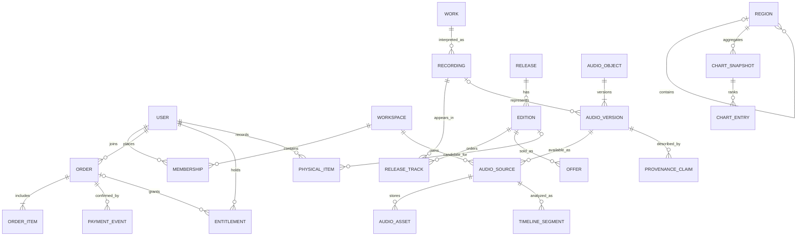

# 음원 오디오 플랫폼 도메인 데이터 모델과 ERD

이 문서는 개념 모델과 구현에 필요한 불변 조건을 정의합니다. 물리 DDL·마이그레이션은 ADR 확정 후 작성하십시오. 공개 카탈로그와 개인 자료가 같은 객체 인터페이스를 쓰더라도 소유·권리·저장 범위는 별개입니다.

## 객체 의미

Work는 작곡·작사 등 작품, Recording은 특정 연주·녹음, Release는 앨범·싱글, Edition은 판본입니다. AudioObject는 재생·분석 가능한 논리 객체이며 master를 교체할 때 기존 객체 버전을 보존합니다. Source는 catalog/private_upload/audio_log/cd_rip 등 유입과 접근 범위, Asset은 실제 바이트와 파생 파일을 나타냅니다. Source를 선택하지 않은 채 공유 AudioObject ID만으로 비공개 권한을 판정하면 안 됩니다.

## 주요 테이블 제안

| 엔티티 | 주요 필드와 제약 |
|---|---|
| User | id, status, locale, created_at, deletion_requested_at |
| Workspace | id, type personal/studio, owner_user_id, quota_policy_id |
| Membership | workspace_id, user_id, role, UNIQUE(workspace_id,user_id) |
| Artist/Contributor | id, display_name, verified_scope, external_ids |
| Work | id, title, composer/publisher 관계, identifiers |
| Recording | id, work_id nullable, artist 관계, ISRC nullable, version_label |
| Release/Edition | release_id, edition_id, label, UPC nullable, release_date, territory |
| ReleaseTrack | edition_id, position, recording_id, UNIQUE(edition_id,position) |
| AudioObject | id, kind, duration_ms, status, current_version_id, schema_version |
| AudioVersion | id, audio_object_id, version_no, recording_id nullable, content_hash |
| AudioSource | id, audio_version_id, workspace_id, origin, visibility, rights_context_id |
| AudioAsset | id, source_id, kind master/codec/stem/waveform, storage_key, checksum, bytes, codec, encryption_key_ref |
| TimelineSegment | id, source_id, layer, start_ms, end_ms, payload_ref, confidence, model_version |
| ProvenanceClaim | id, subject_version_id, claim_type, issuer, evidence_ref, signature_status, review_scope |
| AudioRelationship | from_version_id, to_version_id, relation_type, evidence_ref, disputed |
| Credit | recording/release_id, contributor_id, role, creation_method, evidence_ref |
| RightsGrant | id, rights_holder_id, resource_id, territory, uses, valid_from/to, status, contract_version |
| Offer | id, edition_id, seller_id, territory, price_minor, currency, terms_version, capability_set |
| Order/OrderItem | id, user_id, state, totals, offer_snapshot, payment_provider_ref |
| PaymentEvent | provider, event_id UNIQUE, order_id, payload_hash, verified_at |
| Entitlement | id, user_id, scope, resource_id, capabilities, origin_order/subscription_id, validity, status |
| Subscription | user_id, provider_ref UNIQUE, plan, state, paid_through |
| LedgerEntry | id, transaction_id, account_id, debit/credit, amount_minor, currency, origin_ref |
| ListeningSession/Event | session_id, source_id, user_pseudonym, event_id UNIQUE, sequence, client/server_time, accepted_duration |
| AudioLog | id, source_id UNIQUE, author_user_id, title, note, linked_recording_id |
| ArchiveEntry | id, user_id, source/release/log_ref, saved_at, origin, user_note |
| PhysicalItem | id, user_id, media_type, edition_id nullable, declared_at, verification_level |
| PhysicalEvidence | id, item_id, private_asset_ref, reviewer, decision, retention_until |
| Region | id, parent_id, type, name, geometry_version |
| ArtistRegion | artist_id, region_id, relation born/active/recorded, evidence_ref |
| Consent | user_id, purpose, version, granted_at, withdrawn_at, precision |
| ContextRecord/Trip | id, user_id, local_time_zone, region_id nullable, coarse_context, consent_id |
| ChartSnapshot/ChartEntry | snapshot_id, region_id, category, window, algorithm_version, eligible_population, rank, score |
| ModerationCase/Appeal | id, subject_ref, reason, evidence_refs, status, reviewer, decision_version |
| Project/ProjectVersion | workspace_id, title, immutable_version_ref, visibility private |
| UploadSession/ProcessingJob | workspace_id, reserved_bytes, expected_hash, state, expires_at, retry_key |
| Playlist/PlaylistItem | owner_workspace_id, visibility, ordered source/recording refs, item 권한은 별도 |
| Curator/CuratorFollow | curator_user_id, editorial_scope, follower_user_id, 공개 여부 |
| AudioPreference | user_id, device_class, DSP_config_version, consent_id, original_default |
| AudioDrop | author_user_id, source_id, coarse_region_id, audience, expires_at, recipient_consent |

프라이빗 녹음은 Work/Recording과 연결되지 않아도 존재할 수 있습니다. ISRC와 barcode는 식별 보조 자료이며 파일 동일성·권리·실물 소유의 단독 증거로 사용하지 않습니다. 상세 증빙은 보안 저장소에 두고 공개 Passport에는 허용된 요약만 표시합니다.

## 핵심 ERD



ERD는 핵심 관계만 보여줍니다. 실제 구현에서는 Credit, RightsGrant의 resource 연결에 타입별 FK 테이블을 사용하거나 참조 무결성을 보장하는 resource registry를 도입하십시오. 무검증 문자열 polymorphic ID만으로 정산과 권리 대상을 연결하지 않습니다.

## 불변 조건과 트랜잭션

- 모든 AudioSource에는 workspace와 접근 범위가 있습니다. 공개와 비공개 asset을 같은 CDN namespace에 혼합하지 않습니다.
- fingerprint 유사성은 object merge의 후보일 뿐입니다. 자동 병합으로 구매 권한·원본·provenance·개인 메타데이터를 덮어쓰지 않습니다.
- 결제 이벤트 수신 기록, 주문 상태 변경, entitlement 생성, outbox 기록은 동일 DB 트랜잭션에서 처리합니다. 외부 지급은 별도 대사합니다.
- 원장 거래의 차변 합과 대변 합은 통화별로 같아야 합니다. 금액은 정수 minor unit이며 통화와 세금 snapshot을 보존합니다.
- `0 <= start_ms < end_ms <= duration_ms`를 검증합니다. 모델 재분석은 기존 수동 편집본을 덮어쓰지 않습니다.
- RightsGrant는 쓰임새별 streaming/download/preview/transform/stem/analysis를 구분합니다. physical 인증에서 Entitlement로 자동 연결되는 FK나 trigger를 두지 않습니다.
- entitlement 상태와 계약 권리 모두 허용해야 재생됩니다. 구매 계약에 지속 제공 조항이 있으면 별도 유효 grant로 명시합니다.
- 삭제 tombstone은 파생 자료가 늦게 생성되어 다시 노출되지 않도록 작업 시작·종료 시 검사합니다.

## 인덱스와 저장 분리

사용자 목록은 `(user_id,created_at,id)`, source 접근은 `(workspace_id,status)`, segment는 `(source_id,layer,start_ms)`, grant는 resource·territory·기간, 차트는 `(region_id,category,window_end)`를 인덱싱합니다. 대용량 ListeningEvent는 날짜 파티션과 이벤트 ID 중복 방지 정책을 사용합니다.

트랜잭션은 관계형 DB, 원본은 객체 저장소, 텍스트·vector는 파생 검색 인덱스, 청취 집계는 분석 저장소에 둡니다. 그래프는 우선 관계 테이블로 시작하고 별도 graph DB는 실제 쿼리와 운영비가 정당화할 때 도입합니다. 원본 DB가 삭제와 권한의 정본이며 검색 인덱스는 복구 가능한 파생 자료입니다.

## 보존과 버전 관리

원본 checksum, 변환 도구 버전, 모델 버전, 계약·상품·동의 버전을 기록합니다. 법적 원장 보존과 개인 콘텐츠 삭제는 분리하되 남기는 정보는 법률 검토로 최소화합니다. 백업에서 계정 복원 시 삭제 tombstone을 재적용합니다. 기간 제안은 [08](08-security-privacy.md)이 정본입니다.

## 데이터 계약 예시

공통 객체의 외부 표현은 아래처럼 source별 capability를 반환합니다. fingerprint와 저장 key는 외부 응답에서 기본적으로 제외합니다. `owner_workspace_id` 등 내부 개인정보는 타 계정의 공개 조회에 포함하지 않습니다.

```json
{
  "audio_object_id": "audio_1",
  "version_id": "version_1",
  "source_id": "source_private_1",
  "kind": "audio_log",
  "origin": "recording",
  "visibility": "private",
  "duration_ms": 184200,
  "status": "ready",
  "capabilities": {"play": true, "download": true, "publish": false, "analyze": false},
  "schema_version": 1
}
```

개인 원본의 download capability는 해당 사용자의 보관 자료 export이며 상업 catalog download를 의미하지 않습니다. 사용자가 같은 recording의 catalog source와 개인 업로드 source를 갖고 있어도 서로 다른 capability와 asset을 유지합니다.
