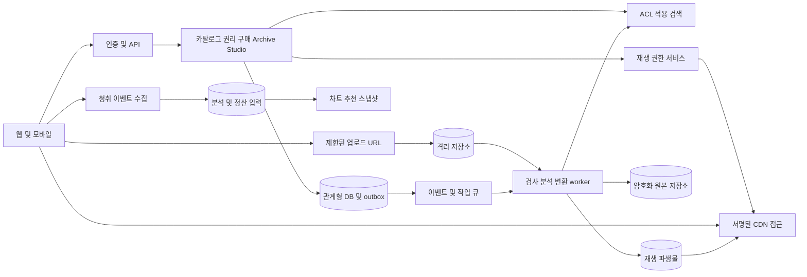

# 음원 오디오 플랫폼 시스템 아키텍처

이 문서는 백엔드, 오디오 처리, 스트리밍, 검색·추천, 저장소와 CDN의 책임을 정의합니다. 기술 선택은 설계 제안이며 [15 ADR](15-adr-open-questions.md) 승인 전 특정 공급자를 확정하지 않습니다.

## 초기 구성과 확장 경계

초기에는 모듈형 백엔드와 별도 비동기 오디오 worker를 제안합니다. 계정·카탈로그·권리·주문·entitlement·운영은 명확한 모듈 경계를 갖되 불필요하게 각각 마이크로서비스로 나누지 않습니다. 일반 API를 처리하는 제어 경로와 오디오 바이트를 전달하는 미디어 경로를 분리합니다.

## 백엔드와 이벤트

관계형 DB를 주문·권리·계정의 정본으로 삼고 transaction outbox로 이벤트를 발행합니다. queue는 at-least-once를 가정하며 handler는 event_id와 작업 key로 멱등하게 처리합니다. schema_version, correlation_id, occurred_at, subject_id, workspace_id, privacy_scope를 포함합니다. 메시지에 음성·전사 원문이나 결제정보를 넣지 않습니다.

반복 실패는 지수 backoff 후 DLQ로 이동하고 운영 콘솔에서 재처리합니다. 순서가 필요한 상태는 version 검사로 이전 이벤트가 새 상태를 되돌리지 않도록 합니다. 시스템 전반 exactly-once를 약속하지 않고 원장·주문에서 중복 방지와 대사를 제공합니다.

## 업로드와 오디오 처리

업로드 세션은 허용 key, 크기, MIME 후보, checksum, 만료와 workspace 용량 예약을 발급합니다. 클라이언트가 API 서버를 거치지 않고 격리 저장소에 전송합니다. 완료 호출은 실제 저장 객체의 크기·해시를 검증합니다. 파일 디코더는 제한된 CPU·메모리·시간과 네트워크 차단된 실행 환경에서 처리합니다.

원본 검증 → 포맷·duration 추출 → fingerprint → loudness·true peak·파형 → codec 변환 → manifest → 선택적 ML 분석 → ready 이벤트 순서입니다. ML 실패로 기본 재생을 막지 않습니다. 원본은 불변으로 저장하고 변환 파생물만 재생성합니다. 오디오별 sample rate와 encoder delay/padding을 유지해 gapless를 검증합니다.

기본 codec ladder는 AAC 계열의 호환성 중심 안을 검토하고 Opus/FLAC 등은 지원 장치와 계약을 확인해 추가합니다. 구체 bitrate·segment 길이는 네트워크·시작 지연·gapless 테스트로 ADR에서 선택합니다. 예를 들어 2~6초 segment는 실험 범위이며 확정 규격이 아닙니다. lossless는 허용된 원본과 실제 lossless 경로에서만 표시합니다.

## 스트리밍과 CDN

HLS는 manifest와 segment를 분리하는 전달 방식의 후보입니다. 기본 개념은 [RFC 8216](https://www.rfc-editor.org/info/rfc8216/)에 근거하며 실제 지원은 현재 클라이언트·플레이어로 검증합니다. 원본 master는 직접 공개하지 않습니다. CDN은 private origin과 서명 URL 또는 cookie, 필요한 DRM을 사용합니다.

재생 API는 source, rights version, entitlement version, 지역 및 capability를 검증하고 단기 session을 발급합니다. manifest뿐 아니라 segment 접근도 보호합니다. 제안 만료는 세션 5분, segment 자격 60초 이하이며 취소 SLA와 캐시 성능을 실험 후 확정합니다. 허용 캐시 key를 유지하면서 접근 토큰이 사용자 간 노출되지 않도록 구성합니다.

권리 철회는 신규 세션 즉시 거부, 활성 세션 갱신 차단, CDN invalidation/edge deny, 오프라인 라이선스 만료를 함께 적용합니다. 이미 재생 버퍼에 들어간 바이트나 DRM 없는 구매 다운로드는 회수할 수 없습니다. 이를 권리 계약과 사용자 조건에 반영합니다. signed URL만으로 DRM 요구를 충족했다고 간주하지 않습니다.

오프라인은 M2 후보입니다. 기기별 암호화·만료·권리 갱신을 적용하고 구매 download와 구독 offline을 분리합니다. 여행 국가 판단은 Atlas 지역 입력을 사용하지 않으며 계약상 허용된 계정·결제국·접속국 정책으로 판단합니다.

## 검색과 추천

M1은 제목·아티스트·앨범·credits 검색과 사람 큐레이션부터 시작합니다. M2는 segment 전사·구조 검색, vector 검색, 개인 청취 시간 필터와 evidence 반환을 추가합니다. 검색 실행 전 workspace/visibility/rights scope를 제한하고 결과 반환 때 정본 권한을 다시 확인합니다. 권한 없는 후보를 LLM이나 reranker에 보내지 않습니다.

추천은 허용 카탈로그 후보 → 사용자 AI 정책 → fraud·integrity 적격성 → 선호·다양성·신규 아티스트 탐색 → 표시 순서입니다. 개인 자료를 공개 추천·전체 모델 학습에 사용하지 않습니다. 인덱스 장애 시 허가된 정적 큐레이션으로 fallback하고 비공개 semantic 검색은 기본 제목 검색으로 제한합니다.

## 고급 DSP와 stems

Personal Acoustic Model과 Adaptive Mastering은 기기 출력 단계의 DSP 설정으로 원본을 보존합니다. 제한된 gain·EQ·compression·limiter와 Original 전환을 제공합니다. 청력 프로필은 건강 관련 위험이 있으므로 진단 대신 청취 선호로 제품화하고 실제 처리 데이터는 [08](08-security-privacy.md)을 따릅니다.

Musical Transition Engine은 beat·downbeat·key·phrase 분석에서 후보를 만들고 비용·권리·장치 capability로 선택합니다. Stem Streaming은 동일 sample clock과 duration, alignment metadata, multi-buffer, 복합 loudness 관리가 필요합니다. 하나의 stem 지연에도 전체 mix를 fallback시킵니다. 상업 녹음의 자동 stem 분리·변형·저장·배포는 별도 허가 전 구현을 공개하지 않습니다.

Perceptual ABR은 네트워크 버퍼 안정성을 우선하고 사용자 고정 음질, 장치 capability, 지각 품질·배터리를 추가 입력으로 사용합니다. 업로드된 고해상도 source가 있다는 이유로 지각상 개선이나 데이터 절감을 보장하지 않습니다.

## 저장소와 Progressive Archive

원본·파생 재생·개인 증빙·공개 artwork를 분리합니다. 원본은 checksum·version·복구 가능한 복제로 보존하고 cold tier 이동은 재생 빈도와 복구 지연을 고려합니다. checksum 검사와 복구 drill을 정기 실행합니다. 개인 원본의 계정 간 전역 dedup은 기본적으로 하지 않습니다.

사용자 export는 원본과 metadata/credits/timeline/구매 증빙 중 허용 범위를 압축해 단기 링크로 제공합니다. 카탈로그 원본 export는 권리 허가가 없다면 제외합니다. 포맷 이전 시 원본을 보존하고 새 파생물 checksum·도구 버전을 기록합니다. 장기 보존은 운영 약속과 비용 정책이지 무조건적 영구 서비스 보증이 아닙니다.

## 규모 가정과 장애 전략

A04 예시 부하 10,000 MAU, 1,000 peak 동시 청취, 평균 192kbps를 사용하면 오디오 egress는 약 192Mbps이며 프로토콜 여유·lossless·stems는 별도입니다. 1시간당 약 86.4MB이고 월 청취시간을 곱해 비용을 계산합니다. 이는 생산 수요 예측이 아닌 sizing 예시입니다.

권한 서비스·결제 확인 실패 시 신규 권한은 fail closed입니다. 검색·ML 장애는 기본 검색·Original 재생으로 축소합니다. DB 장애는 write를 중단하고 만료 전 이미 발급된 미디어 자격의 지속 여부는 철회 위험에 따라 결정합니다. cache로 오래된 entitlement를 무기한 연장하지 않습니다. 공급자별 비용·가용성·데이터 국외 이전은 ADR에서 비교하십시오.
