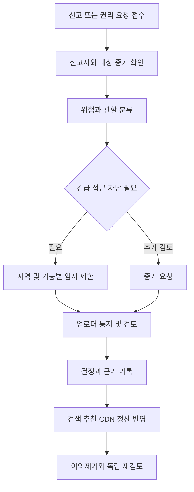

# 음원 오디오 플랫폼 운영 모더레이션 권리자 대응

이 문서는 작품 공개, 신고, 이의제기, 정산과 사고 운영을 정의합니다. 처리 기한은 내부 운영 목표이며 법정 기한은 국가별 법률 검토 결과를 우선합니다. 권리 판단과 음악 품질 판단을 분리합니다.

## 책임 역할

제품 책임자는 정책·사용자 공지를, 권리 책임자는 계약·침해 사례를, Trust 운영자는 스팸·사칭·AI 공개·appeal을, 재무는 결제 대사·지급을, SRE는 접근 차단·복구를 담당합니다. 개인 이름과 인력 규모는 확정하지 않았습니다. 공개 출시 전에 담당·대체 담당·연락 경로·근무시간을 지정하십시오.

## Studio 공개 검토

업로드 검사 → metadata·credits·AI 사용·권리 진술 검증 → 중복·사기 위험 검토 → 필요 증거 요청 → 승인 또는 조건부 보류 → 국가·시점별 공개입니다. 상업 판매자는 신원·지급정보·세무 조건을 먼저 확인합니다. self-declared와 rights-reviewed 상태를 구분하고 운영 검토가 확보하지 않은 권리를 만들어주지는 않습니다.

공개 전 metadata 변경과 master 교체는 새 버전 검토를 유발합니다. 이미 구매한 상품의 제공 파일을 조용히 바꾸지 않고 기존 snapshot·권리 조건을 유지하거나 변경을 안내합니다. 앨범·credits·cover·sample 관계의 잘못된 연결은 정정 이력을 남깁니다.

## 신고와 권리자 사례 흐름

접수 정보는 대상 recording/source/release·국가·주장 권리·연락처·증빙·요구 조치입니다. 악의적 신고·위조도 기록합니다. 즉시 차단 대상은 위험 기준에 따라 좁게 적용하고 하나의 국가·상품 분쟁을 전체 private 자료 삭제로 확대하지 않습니다. 권리자 연락처나 비공개 증거를 상대방에게 그대로 공개하지 않습니다.

확정 결정은 대상 rights version, 재생·download·stems·분석 등 범위, 지급 보류 근거, 사용자 공지를 포함합니다. 구매 고객 영향과 이미 제공된 download의 한계를 함께 검토합니다. counter-notice 등 법적 절차는 관할별로 적용합니다.

## 스팸과 Music Integrity 운영

기술 이상, 미신고 AI 사용, near-duplicate 도배, 메타데이터 조작, 스트리밍 사기, 음성 사칭을 서로 다른 reason code로 관리합니다. detector score만으로 최종 제재하지 않습니다. 업로드 rate 제한·추천 보류·증빙 검토·공개 제한·반복 악성 계정 제재의 단계와 appeal을 제공합니다.

판정 근거, 정책 버전, reviewer, 시작·종료일을 저장합니다. 검토된 인간 제작 배지는 제작과정의 범위를 표시합니다. 보컬·세션 증거는 민감한 미공개 자료이므로 제한된 reviewer만 접근합니다. 부당한 Human-only 배제·신인 오탐·장르 편향과 appeal reversal을 정기 리뷰합니다.

## 지역 차트 운영

매일 snapshot을 생성하고 fraud 제외, threshold, 권리 가용성, 급격한 순위 이상을 확인합니다. 조작이 의심되면 해당 snapshot을 보류하거나 수정본을 새 version으로 공개합니다. 표본 부족 지역을 가상의 현지 차트로 채우지 않습니다. 사람이 만든 Legends·Historical Listening은 편집자·출처·갱신일을 표시합니다.

아티스트 분석은 충분한 집계만 제공하고 팬 개인의 지역 이동·녹음·구매 신원을 기본 제공하지 않습니다. Music Migration은 관측 확산과 역사적 기원을 구분하는 문구를 검토합니다.

## 결제와 정산

매일 provider 이벤트·주문·entitlement·ledger를 대사하고 계약상 주기로 사용 보고와 권리자 지급을 생성합니다. 통화·세금·계약 버전·유효 청취 기준·분할 지분·수수료·환불·reserve를 기록합니다. 합계와 원장 잔액, 미매핑 recording과 권리자 지분 오류를 검증합니다.

정산 상태는 `calculated → reviewed → approved → paid`와 `held/disputed`입니다. 지급 계좌 변경과 대규모 환불·지급은 승인 분리를 적용합니다. fraud 의심분 지급 보류는 계약·법률에 근거하며 판정 전 몰수 수익으로 인식하지 않습니다. 정산 보고의 정정은 과거 수치를 삭제하지 않고 correction entry로 남깁니다.

## 운영 목표 제안

접수 자동 확인은 즉시, 일반 신고 분류는 1영업일 이내, 보통 appeal 1차 검토는 5영업일 이내를 내부 목표로 제안합니다. 인력과 법적 기한에 따라 확정하십시오. 보안 유출·명백한 긴급 침해·결제 위조는 온콜 경로로 즉시 올립니다. 미응답 backlog와 deadline breach를 공개 출시 후 매주 검토합니다.

## 사고와 서비스 종료

사고 runbook은 private 유출, 권리 취소 미반영, 결제 중복, 원본 손상, decoder 문제, CDN 장애, 차트 조작과 잘못된 모델 배포를 포함합니다. 우선 신규 접근·처리를 중단하고 영향 범위·증거를 보존한 뒤 복구·통지·사후 분석을 수행합니다.

장기 보관 중단이나 서비스 종료 시 사전 공지·허용 원본 export·구매 download·잔액 정산·법적 보존·개인 삭제의 순서를 계약으로 준비합니다. 복구 가능한 백업과 구매 파일 export가 있다고 평생 접근을 보장하지 않습니다.
