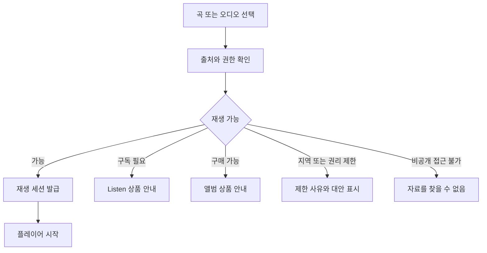
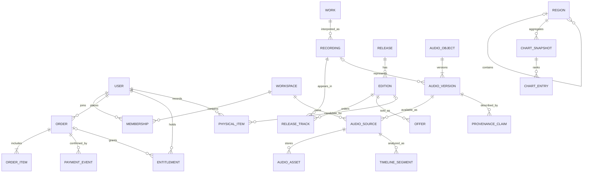
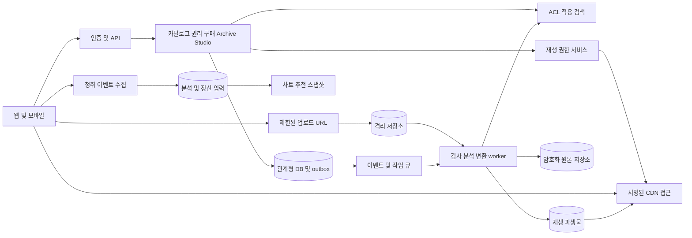
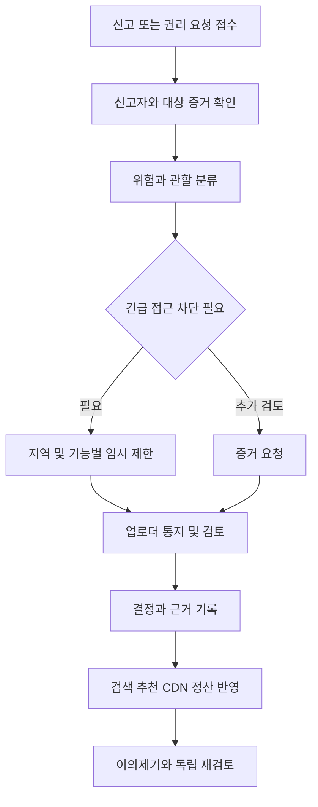

# 음원 오디오 플랫폼 전체 통합 문서

작성일은 2026년 10월 4일이며 버전은 0.1입니다. 이 파일은 마스터 안내와 개발팀용 개별 문서 16개를 순서대로 모은 통합본입니다. 같은 폴더의 개별 문서는 편집 정본이며 통합본은 배포용 읽기 사본입니다. API는 구현 초안이고 법적 검토는 법률자문을 대체하지 않습니다.

## 음원 오디오 플랫폼 개발 착수 마스터 문서

작성일은 2026년 10월 4일이며 버전은 0.1입니다. 이 문서 세트는 제품 책임자, 개발팀, 오디오 및 ML 엔지니어, 운영팀, 재무팀과 법률 검토자가 같은 요구사항을 기준으로 개발을 시작하시도록 작성했습니다. 현재 상태는 검토 가능한 설계 초안이며, 계약 체결이나 기술 검증이 완료된 출시 명세는 아닙니다.

### 제품의 핵심 결정

플랫폼은 Listen, Own, Create, Collect, Remember, Trust를 통합하는 Personal Audio Archive를 지향합니다. 광고 기반 무료 카탈로그 스트리밍은 제공하지 않습니다. 무료 계정은 개인 오디오와 Audio Log, 제한된 Studio 업로드, 컬렉션 기록을 이용하고, 유료 구독은 허가된 카탈로그 스트리밍을 제공합니다. 앨범 구매 권한은 구독과 별개입니다. CD 실물 인증은 디지털 재생 권한으로 자동 전환되지 않습니다.

Universal Audio Object는 재생 인터페이스를 통일하지만 권리와 공개 범위를 통일하지 않습니다. 개인 비공개 업로드, 상업 카탈로그, 구매 앨범과 실물 기록의 접근 권한은 항상 별도로 판단합니다. Trust는 provenance, 크레딧, AI 사용 공개, 추천 선택권, 위치 프라이버시와 권리자 대응에 적용합니다.

### 원문 확인 범위

참조 대화는 「음원 스트리밍 기획」이며 식별자는 `6abdd392-e100-83ee-b47a-24dce6862bd9`입니다. 실제 조회 응답에는 기술적 차별화, AI 음악 대응, 시간과 장소 기능, 지역 차트, 문서화 요청 및 인계 응답에 해당하는 최근 6개 턴만 있었습니다. 페이지 응답에는 이전 커서가 없었습니다. 따라서 이전 전체 대화를 확인했다고 주장하지 않습니다.

현재 요청에 명시된 이전 아이디어를 요구사항으로 반영했고, 조회 가능한 원문의 세부 아이디어도 보존했습니다. 과거 대화에서 확정했을 수 있는 가격, 브랜드, 출시 국가, 무료 용량, 계약 방식, 팀 규모는 복원하지 않고 미결정 사항으로 남겼습니다. 원문에 나온 텍사스·남미 음악 사례는 실제 차트 데이터가 아닌 경험 예시입니다.

### 문서 지도와 정본

| 문서 | 정본으로 관리하는 내용 | 주요 독자 |
|---|---|---|
| [01 제품 비전](01-vision-strategy.md) | 철학, 차별화, 시장 진입 가설 | 제품 및 경영 |
| [02 PRD와 로드맵](02-prd-roadmap.md) | 요구사항 ID, MVP 범위, 출시 게이트 | 전체 팀 |
| [03 기능 명세](03-functional-spec.md) | 상태, 경계 조건, 수용 기준 | 제품 및 개발 |
| [04 UX와 IA](04-ux-ia-flows.md) | 화면 구조, 사용자 플로우, 오류 경험 | 디자인 및 클라이언트 |
| [05 도메인과 ERD](05-domain-data-erd.md) | 데이터 의미, 관계, 불변 조건 | 백엔드 및 데이터 |
| [06 시스템 아키텍처](06-system-architecture.md) | 데이터 흐름, 오디오, CDN, 장애 처리 | 개발 및 SRE |
| [07 API 초안](07-api-draft.md) | 요청, 응답, 오류, 이벤트 계약 | 백엔드 및 클라이언트 |
| [08 보안과 개인정보](08-security-privacy.md) | 권한, 위협, 보존 및 삭제 | 개발 및 개인정보 담당 |
| [09 법적 리스크](09-legal-risk-checklist.md) | 법률 검토 대상과 출시 차단 조건 | 법무 및 권리관리 |
| [10 AI와 Music Integrity](10-ai-ml-integrity.md) | 분석, 추천, 차트, 모델 평가 | ML 및 운영 |
| [11 사업과 경제성](11-business-unit-economics.md) | 매출, 원가, 현금, 실험 | 경영 및 재무 |
| [12 운영](12-operations-rightsholders.md) | 모더레이션, 신고, 정산, 권리자 대응 | 운영 및 지원 |
| [13 품질 전략](13-observability-slo-tests.md) | SLO, 관측성, 테스트, 출시 검증 | QA 및 SRE |
| [14 백로그](14-backlog-epics.md) | 작업 분할, 의존성, 우선순위 | 개발팀 |
| [15 ADR과 미결정 사항](15-adr-open-questions.md) | 기술 결정 기록 및 담당 역할 | 기술 및 제품 책임자 |
| [16 추적표와 출처](16-traceability-sources.md) | 요구사항 연결과 출처의 한계 | 전체 팀 |

상충할 경우 제품 범위는 02, 기능 행동은 03, 데이터 불변 조건은 05, 권한은 08을 정본으로 삼으십시오. 법률 검토나 계약 조건이 기존 설계와 충돌하면 출시를 중단하고 관련 요구사항과 ADR을 함께 수정하십시오. API는 기능과 권한의 파생 계약입니다.

### 가정과 제안의 해석

`확정 요구`는 현재 사용자 요청에서 명시한 방향입니다. `설계 제안`은 개발 착수를 위한 작성자의 선택이며 제품팀 검토 후 확정하셔야 합니다. `가정 A`는 일정·가격·규모 계산에 사용하는 임시 입력입니다. `미결정 Q`는 담당자가 답해야 하는 항목입니다. `검증 R`은 연구 또는 계약 확인이 필요한 기능입니다. 단계 M0~M3은 일정 약속이 아닌 출시 의존성입니다.

법적 체크리스트는 법률자문을 대체하지 않습니다. 한국을 우선 검토 시장으로 가정했지만 서비스 국가와 적용법은 확정하지 않았습니다. 법령 페이지를 열어 확인했으나 자동 조회에서 조문 본문이 제공되지 않았으므로 최신 조문·시행일·판례의 검증 완료로 표시하지 않았습니다.

### 개발 착수 순서

먼저 02의 MVP 범위와 15의 Q01~Q06을 제품·권리·기술 책임자가 검토하십시오. 계정, Universal Audio Object, 비공개 업로드와 공통 플레이어를 M0에서 구현하고, 권리 계약이 승인된 카탈로그만 M1에 연결하십시오. 결제 원장과 entitlement, 권리 취소, 삭제 전파, 접근 격리를 공개 출시 전 필수 검증으로 두십시오. 데이터가 부족한 지역 차트는 합성 데이터를 실제 현지 인기처럼 표시하지 마십시오.

### 전체 출시 차단 조건

- 출시 국가별 스트리밍·다운로드·구매 및 무료 공개 Studio 재생에 필요한 권리 계약이 없습니다.
- 계정 간 비공개 오디오, 전사, 벡터 또는 다운로드 링크가 유출됩니다.
- 결제 중복·환불·권리 취소가 구매 권한과 정산에 일관되게 반영되지 않습니다.
- 원본 복구, 삭제 전파, CDN 무효화와 운영 권리자 대응 절차가 검증되지 않았습니다.
- 미검증 AI 판정을 사실로 표시하거나 계약 없이 CD 인증으로 상업 음원을 제공합니다.

### 산출물 사용 방법

개별 문서는 상대 링크로 서로 연결되어 폴더를 이동해도 함께 읽으실 수 있습니다. 기술 도식은 Mermaid 형식이며 지원 편집기에서 렌더링하실 수 있습니다. API와 데이터 모델은 구현 초안이고 생성 코드나 실제 실행 중인 서버는 포함하지 않습니다. PR마다 관련 요구사항 ID, API 변경, 수용 기준, ADR과 테스트 증거를 첨부하십시오.


## 음원 오디오 플랫폼 제품 비전과 전략

이 문서는 제품이 해결할 문제와 투자 우선순위를 정의합니다. 출시 범위의 정본은 [02 PRD](02-prd-roadmap.md)이며 기능의 세부 행동은 [03 명세](03-functional-spec.md)를 참조하십시오.

### 비전과 사용자 문제

사용자가 듣고 구매하고 만들고 수집하고 기억하는 오디오를 하나의 개인 아카이브에서 관리하시도록 합니다. 구독에서 발견한 음악, 구매한 앨범, 직접 녹음한 목소리와 실물 컬렉션은 서로 연결되지만 각자의 권리와 보존 조건을 유지합니다.

현재 해결하려는 문제는 서비스마다 분리된 청취·소유·제작 기록, 음악의 출처와 버전 확인의 어려움, 개인 녹음 검색의 한계, 대량 스팸 음악에 의한 발견 경험 훼손과 여행 중 지역 음악을 알아보기 어려운 점입니다. 이 문제의 크기와 지불 의사는 고객 조사로 검증하셔야 합니다.

### 여섯 가지 철학

| 철학 | 제품에 적용하는 원칙 | 성공 신호 |
|---|---|---|
| Listen | 광고 없이 허가된 음악을 깊게 들으시도록 합니다. | 자발적 재청취, 앨범 완주, 만족도 |
| Own | 앨범 단위 구매를 구독과 독립적으로 관리합니다. | 구매 전환, 재다운로드 성공 |
| Create | 무료 Studio 진입과 유료 제작 도구를 제공합니다. | 업로드 성공, 프로젝트 재사용 |
| Collect | 디지털 앨범과 실물 판본을 연결합니다. | 컬렉션 등록과 정정 |
| Remember | 개인 Audio Log와 청취 맥락을 보존합니다. | 기록 생성, 재발견, 내보내기 |
| Trust | 출처·권리·AI 사용·데이터 처리 범위를 설명합니다. | 신뢰 만족도, 이의제기 해결률 |

장기 아카이브의 가치를 잠금 효과로만 사용하지 않습니다. 사용자가 원본과 기록을 내보내실 수 있어야 합니다. 구매한 콘텐츠의 서비스 지속 제공 범위는 계약으로 정하며, 저작권 자체를 구매한다는 표현이나 플랫폼의 무조건적 영구 제공 약속은 사용하지 않습니다.

### 주요 고객과 초기 진입 가설

초기 고객은 독립 아티스트와 그 팬, 앨범 중심 청취자, 개인 녹음 아카이브 사용자입니다. 오디오 애호가와 실물 수집가는 판본·provenance 기능의 초기 검증 그룹으로 둡니다. 여행자는 Music Atlas 확장 고객입니다. 모든 고객을 동시에 겨냥하기보다 소규모 직접 계약 카탈로그와 개인 아카이브에서 통합 경험을 먼저 검증하는 전략을 제안합니다.

대형 글로벌 카탈로그 확보는 계약·최저보장·운영 자본에 의존합니다. 개발 완료가 카탈로그 확보를 보장하지 않습니다. 초기 제품은 확보된 카탈로그 범위와 지역 제한을 정확하게 알리셔야 합니다.

### 사업 포트폴리오

무료 계정은 사용자 관계의 진입점이고 유료 스트리밍은 반복 청취 상품입니다. 앨범 거래와 Artist/Creator commerce는 작품에 대한 직접 지불을 지원합니다. Studio SaaS와 개인 보관 용량 상품은 스트리밍 외 매출을 검증합니다. 수익성은 [11 경제성](11-business-unit-economics.md)의 상품별 공헌이익으로 판단하십시오.

무료 Studio 업로드는 모든 상업 음악을 무료로 듣는 모델을 의미하지 않습니다. 공개 제작물의 무료 재생은 업로더와 관련 권리자가 허가한 범위로만 운영합니다. 별도의 무료 카탈로그 무제한 재생이나 광고 수익은 기본 모델에 포함하지 않습니다.

### 차별화와 기술 투자

기반 기술은 Universal Audio Object, 권한 계층, fingerprint, 통합 플레이어, provenance 및 개인 아카이브입니다. 이후 Semantic Audio Timeline/Search, Credits Graph와 사람 큐레이터로 발견 경험을 확장합니다. Personal Acoustic Model, Adaptive Mastering, Perceptual ABR, Musical Transition Engine 및 Stem Streaming은 검증된 사용자 가치와 원가가 있을 때 투자합니다.

Music Atlas는 실제 현지 청취와 문화적 큐레이션을 구분합니다. Local Top과 Rising Here는 관측 청취, Local Gems는 상대적 지역성, Local Legends와 Made Here는 장기 문화 및 아티스트 연결을 표현합니다. 텍사스에는 컨트리를 틀어야 한다는 고정관념을 알고리즘에 심지 않습니다.

### 성공 지표와 방어 지표

설계 제안 북극성 지표는 주간 의미 있는 아카이브 활동 사용자 수입니다. 유효 청취 후 저장·구매·직접 재청취, Audio Log 생성·재발견 또는 컬렉션 관리를 한 사용자를 세며 봇 이벤트는 제외합니다. 서비스 유형별 활성 사용자를 함께 보고 하나의 행동에 과도한 가중치를 주지 않습니다.

유료 유지율, 청취자당 공헌이익, 무료 사용자당 비용, 아티스트 정산 정확도, 비공개 자료 유출 건수, 스팸 노출 비율, 접근성 오류를 방어 지표로 둡니다. 높은 재생시간이나 구매액을 음악의 객관적 품질로 간주하지 않습니다.

### 비목표와 검증 실험

광고 기반 무료 스트리밍, CD 보유에 따른 자동 상업 카탈로그 무료 제공, 타 서비스 음원 무단 가져오기, AI 생성 여부에 따른 일괄 퇴출은 비목표입니다. 초기 고객 인터뷰, 소규모 유료 베타, 무료 업로드 비용 실험, 앨범 구매와 다운로드 파일 사용 조사, 지역 차트 탐색 실험을 진행하십시오. 실험 표본과 합격 기준은 제품팀이 출시 국가와 예산 확정 후 사전에 등록하십시오.


## 음원 오디오 플랫폼 PRD와 단계별 로드맵

이 문서는 요구사항과 출시 단계의 정본입니다. M0~M3은 의존 순서이며 달력 일정이 아닙니다. 계약·실험·팀 역량이 확정되면 [14 백로그](14-backlog-epics.md)를 기반으로 추정하십시오.

### 요구사항 레지스트리

| ID | 요구사항 | 최초 단계 | 우선순위 |
|---|---|---|---|
| REQ-01 | 무료 계정, 제한된 개인 보관 및 Studio 업로드 | M0 | P0 |
| REQ-02 | 광고 없는 유료 카탈로그 스트리밍 | M1 | P0 |
| REQ-03 | 앨범 구매, 소유 라이브러리, 계약상 다운로드 | M1 | P0 |
| REQ-04 | 비공개 개인 오디오, Audio Log, 기록·내보내기 | M0 | P0 |
| REQ-05 | CD 및 Physical Collection 등록·인증·판본 | M1 등록, M2 인증 | P1 |
| REQ-06 | 계약 기반 Digital Upgrade | M3 조건부 | P2 |
| REQ-07 | Universal Audio Object와 Unified Player | M0 | P0 |
| REQ-08 | Semantic Audio Timeline/Search, 허밍 검색 | M2, 허밍 M3 | P1 |
| REQ-09 | Audio Provenance/Music Passport/Credits Graph | M1 기본, M2 그래프 | P0 |
| REQ-10 | AI 음악 공개·선택권·품질·스팸 대응 | M1 | P0 |
| REQ-11 | Personal Acoustic Model/Personal Master | M3 검증 | P2 |
| REQ-12 | Adaptive Mastering/Original 비교 | M3 검증 | P2 |
| REQ-13 | Perceptual ABR/명시적 음질 선택 | M3 검증 | P2 |
| REQ-14 | Musical Transition Engine/Infinite Mix/Stem Streaming | M3 검증 | P2 |
| REQ-15 | Local Charts/Gems/Legends/Rising Here/Made Here/Music Atlas | M2 | P1 |
| REQ-16 | 위치 선택권, 개인 Place Memory, 여행 기록 | M2 | P0 개인정보, P1 기능 |
| REQ-17 | Artist/Creator commerce, 팬 관계, 디지털 상품 | M1 앨범, M2 확장 | P1 |
| REQ-18 | Studio SaaS 프로젝트·버전·협업·분석 | M0 업로드, M2 SaaS | P1 |
| REQ-19 | Progressive Audio Archive/Audio Memory Model | M0 보존, M3 모델 | P1 |
| REQ-20 | 운영·보안·권리·정산·관측성 | 전 단계 | P0 |
| REQ-21 | Context Graph, Time Radio/Travel, Season, Sunset, Journey | M3 | P2 |
| REQ-22 | Audio Drop/친구 Drop/Artist Location Drop/Historical Listening | M3 조건부 | P2 |
| REQ-23 | Human Curator/Slow Discovery/Album-first Discovery | M1 수동, M2 확장 | P1 |
| REQ-24 | Music Migration/지역·시대 탐색/Music Map | M2 지도, M3 확산 | P2 |

P0는 해당 단계 출시 필수이고 P1은 핵심 확장이며 P2는 연구 또는 후속 상품입니다. 기능이 M3이어도 비공개 격리·권리 확인 같은 기반 요구는 M0부터 적용합니다.

### 상품 권한

| 기능 | 무료 계정 | 유료 Listen | 구매 고객 | Studio 유료 |
|---|---|---|---|---|
| 개인 업로드와 Audio Log | 제한 용량 | 기본 또는 추가 용량 | 무료 기준 | 프로젝트 요금제 기준 |
| 상업 카탈로그 전체 재생 | 불가 | 계약 지역에서 가능 | 구매 앨범만 가능 | 별도 Listen 필요 |
| 허가된 미리듣기와 공개 창작물 | 계약이 허용할 때만 | 가능 | 가능 | 가능 |
| 앨범 구매와 재생 | 가능 | 가능 | 구독 없이 가능 | 가능 |
| 구매 파일 다운로드 | 구매 계약별 | 구매 계약별 | 구매 계약별 | 구매 계약별 |
| CD 등록 | 가능 | 가능 | 가능 | 가능 |
| 공개 릴리스 | 심사와 권리 확인 | 동일 | 동일 | 동일 |
| 협업·대용량·전문 분석 | 제한 | 별도 | 별도 | 상품별 |

용량·길이·동시 재생·프로젝트 수는 Q03으로 남기고 서버 측 plan policy로 관리합니다. 예시값을 영업 약속으로 사용하지 마십시오. 구독 종료는 구매 권한과 개인 원본을 자동 삭제하지 않습니다. 저장 용량 감소 시 유예·내보내기 절차를 적용합니다.

### 단계와 종료 조건

| 단계 | 포함 범위 | 종료 조건 |
|---|---|---|
| M0 내부 알파 | 계정, 비공개 업로드, Audio Log, 객체 모델, 통합 플레이어, 삭제·내보내기, 운영 콘솔 | 접근 격리·원본 복구·업로드 재시도·삭제 전파 검증 |
| M1 제한 공개 MVP | 직접 허가 카탈로그, 유료 구독, 앨범 판매, entitlement, 기본 Passport/AI 공개, 실물 수동 등록, 사람 큐레이션 | 국가별 계약, 결제·환불·권리 취소·정산, SLO와 운영 준비 승인 |
| M2 제품 확장 | Semantic 검색, 그래프, Studio SaaS, Creator commerce, Music Atlas, 위치 opt-in, 판본 후보 식별 | ML 품질·ACL 평가, 차트 표본·대표성·프라이버시 기준 충족 |
| M3 연구 상품화 | DSP/Perceptual ABR/stems, Audio Memory, Context 기능, Drops, Music Migration, 계약형 Upgrade | 별도 권리 승인, 청취 평가, 비용·배터리·안전 검증 |

MVP는 M1이며 M0의 기능을 포함합니다. 마켓플레이스의 모든 종류, 글로벌 카탈로그, 실물 배송, 자동 CD 업그레이드, 완전한 AI 음악 탐지, 전 지역 차트는 MVP 약속에 포함하지 않습니다.

### 사용자 스토리와 주요 수용 기준

- 무료 사용자는 본인 녹음을 업로드하고 비공개로 재생·삭제·내보내실 수 있어야 합니다. 다른 계정의 목록·검색·링크 재생은 거부해야 합니다.
- 유료 청취자는 현재 지역에서 허가된 곡을 광고 없이 재생하실 수 있어야 합니다. 구독 만료와 권리 취소 시 신규 세션을 거부해야 합니다.
- 앨범 구매자는 결제 확정 후 구독 없이 해당 상품의 권한을 받으셔야 합니다. 결제 웹훅 반복 수신이 중복 구매나 중복 정산을 만들면 안 됩니다.
- 제작자는 비공개 프로젝트와 공개 배포를 구분하실 수 있어야 합니다. 업로드 성공만으로 공개나 수익화가 되면 안 됩니다.
- AI 정책을 선택한 사용자는 추천과 직접 검색의 차이, 검증되지 않은 출처를 확인하실 수 있어야 합니다.
- 여행자는 위치 권한 없이 지역을 수동 선택하실 수 있어야 합니다. 해당 지역 데이터가 부족하면 상위 지역 또는 표시된 큐레이션으로 이동합니다.

### 가정과 제품 결정

A01은 한국 우선 검토, A02는 초기 직접 계약 아티스트 중심, A03은 네이티브 모바일과 웹 관리 도구의 조합입니다. 모두 제안이며 확정 사항이 아닙니다. 무료 용량, 첫 카탈로그, 가격·세금, 다운로드 보장, 미성년자 정책과 첫 지원 기기는 [15 Q 목록](15-adr-open-questions.md)에서 확정하십시오.

### 변경 관리

요구사항은 삭제하지 않고 상태를 `proposed/approved/deferred/retired`로 관리하십시오. 가격·권한 변경에는 기존 구매자의 계약 영향 검토가 필요합니다. 기능 수용 기준은 [03](03-functional-spec.md), 검증 기준은 [13](13-observability-slo-tests.md), 작업 단위는 [14](14-backlog-epics.md)에 연결하십시오.


## 음원 오디오 플랫폼 상세 기능 명세

이 문서는 사용자에게 보이는 행동과 상태 전이의 정본입니다. 권한 판정은 [08](08-security-privacy.md), 데이터 구조는 [05](05-domain-data-erd.md), API는 [07](07-api-draft.md)를 참조하십시오. 별도 표기가 없는 수치 제한은 확정하지 않은 정책값입니다.

### 계정과 무료 업로드

REQ-01과 REQ-18에 대해 이메일 등 검증된 계정으로 개인 공간과 Studio 공간을 만듭니다. 무료 업로드는 저장 바이트·파일 길이·동시 처리·월간 분석 예산을 서버에서 제한합니다. 상향 요금제도 무제한 분석·배포를 약속하지 않습니다.

업로드 상태는 `created → uploading → uploaded → quarantined → processing → ready`이며 오류는 `failed`, 취소는 `cancelled`입니다. 완료 검증 전 재생 링크를 발급하지 않습니다. 부분 업로드는 만료 후 정리합니다. 확장자뿐 아니라 실제 포맷·크기·해시를 확인하고 위험한 파일 및 디코더 오류는 격리합니다.

수용 기준 AC-01은 이어 올리기, 중복 완료 요청, 용량 경쟁, 파일 손상, 업로드 중 계정 삭제와 작업 실패 후 재시도를 포함합니다. 서로 다른 계정의 해시가 같아도 비공개 존재 여부나 파일이 공유되어서는 안 됩니다.

### 공통 재생과 유료 스트리밍

REQ-02와 REQ-07의 플레이어는 AudioObject를 입력받고 서버에서 허용된 재생 capability만 사용합니다. 대기열, 재생·일시정지·탐색·반복·기본 음량 정규화, 앨범 순서 재생을 제공합니다. 출처는 카탈로그·구매·개인 업로드·녹음 중 현재 선택된 source로 표시합니다.

서버 판정은 계정 상태, 선택한 source와 visibility, 해당 기능의 entitlement, 국가·계약 기간, 정책 제한의 순서로 시행합니다. DSP·다운로드·stems는 별도 capability입니다. 지역 차트에서 발견했어도 여행지나 청취자의 현재 라이선스 지역에서 재생 불가할 수 있으므로 이유를 표시합니다.

AC-02는 구독 활성·만료·연체·환불·지역 이동, CDN 만료, 네트워크 전환, 대기열 중 권리 취소와 오프라인 캐시 만료를 검증합니다. 실제 원장 정산용 유효 청취와 UI 재생 로그의 기준은 구분합니다.

### 앨범 구매와 소유

REQ-03의 판매 단위는 release edition에 대응하는 Offer입니다. 구매 시 트랙 목록, 품질, 가격·세금·통화, 다운로드 여부, 제공 범위, 판매자와 환불 조건을 고정한 상품 snapshot을 저장합니다. 나중에 앨범 메타데이터가 변경되어도 주문을 덮어쓰지 않습니다.

주문은 `pending → paid → fulfilled` 또는 `cancelled/expired`입니다. 환불은 별도 `refund_pending → refunded/failed`로 관리하고 전액·부분 환불 정책에 따라 권한을 조정합니다. 외부 결제 승인 화면은 지급 확정의 정본이 아니며 검증된 결제 제공자 이벤트와 대사를 사용합니다.

AC-03은 웹훅 역순·중복, 결제 성공 뒤 응답 유실, 세금 계산, 구매 중 상품 철회, 중복 구매 확인, 환불 후 신규 다운로드 거부, 구독 해지 후 구매 앨범 재생을 포함합니다. 이미 내려받은 허가된 파일을 원격으로 회수할 수 있다고 약속하지 않습니다.

### 개인 오디오와 Audio Log

REQ-04는 개인 FLAC/WAV 등 오디오와 마이크 녹음, 제목·태그·노트·연결 곡·날짜를 지원합니다. Audio Log는 기본 비공개이며 공개 음악 릴리스와 다른 흐름입니다. 클라이언트 임시 녹음은 저장 완료 확인까지 유지하고 사용자가 재시도·폐기하실 수 있도록 합니다.

전사와 의미 분석은 별도 opt-in입니다. 타인의 목소리가 담긴 자료의 동의·취급 안내를 제공합니다. 타임스탬프는 UTC와 사용자 당시 시간대를 함께 저장합니다. 날짜·여행 기록 정정이 원본 녹음의 provenance를 삭제해서는 안 됩니다.

AC-04는 마이크 거부·중단·저장 실패, 전사 비동의, 타 계정 검색 차단, 원본·메타데이터 내보내기, 삭제 후 검색·벡터·파형·CDN 제거를 포함합니다.

### Physical Collection과 Digital Upgrade

REQ-05의 실물 항목은 CD·바이닐 등 종류, barcode, 카탈로그 번호, 판본 후보, 사용자가 입력한 소장 정보와 증빙을 가집니다. 수동 등록은 `self_declared`이고 검토한 증빙은 `evidence_reviewed`입니다. 이는 소장 기록의 수준이지 저작권 보유 인증이 아닙니다.

disc TOC, fingerprint와 metadata로 판본 후보와 confidence를 보여주고 사용자가 정정하실 수 있도록 합니다. 리마스터·동일 음원 재발매를 확정 식별한다고 약속하지 않습니다. CD 리핑 파일은 법률 검토 후 허용 범위의 개인 비공개 source로만 취급합니다.

REQ-06 Digital Upgrade는 권리자가 해당 실물 판본에 대해 제공한 Offer가 있을 때만 할인·고음질·보너스·디지털 구매권 등을 제공합니다. 인증 재사용·양도·중고 CD 정책은 계약에 따릅니다. AC-05는 실물 인증만으로 catalog entitlement가 생성되지 않는 것입니다. AC-06은 upgrade offer 부재·국가 제한·중복 증빙·양도 분쟁에서 권한을 발급하지 않는 것입니다.

### Semantic Audio와 provenance

REQ-08 Timeline은 start_ms/end_ms, 구조·악기·화자·전사 등 layer, 모델 버전과 confidence를 표시합니다. 개인 Log의 문장 검색은 해당 구간으로 이동합니다. 음악 가사·전사 공개와 분석은 권리 범위가 확인된 경우만 허용합니다. 허밍 검색은 직접 녹음 입력을 별도 동의로 처리하고 기본적으로 검색 후 원본을 폐기합니다.

REQ-09 Music Passport는 작곡·작사·보컬·악기·믹싱·마스터링·아트워크의 창작 방식, 크레딧, 출처, 권리 확인 범위, 서명 검증 상태와 이의제기 링크를 제공합니다. Graph는 cover/remix/sample/remaster/live/demo/instrumental/derived_from 관계를 증거와 함께 관리합니다. 관계 확인은 그 관계의 권리 허가를 의미하지 않습니다.

AC-08은 검색 결과가 권한 허용 자료의 구간만 반환하고 근거 없는 기억 답변을 생성하지 않는 것입니다. AC-09는 self-declared, distributor-verified, signature-valid, rights-reviewed를 서로 다른 표시로 제공하는 것입니다.

### Music Integrity와 발견

REQ-10의 기본 제안은 Transparent입니다. Open도 출처 상세 정보는 유지하고, Human First는 인간 주도 제작 자료를 우선하며 Human Only는 검토 기준을 충족한 인간 주도 자료만 자동 추천합니다. 미확인 자료를 자동으로 인간 제작으로 간주하지 않습니다. 직접 검색·사용자 선택 재생은 계속 허용하되 별도 검색 필터를 선택하실 수 있도록 합니다.

AI-assisted mastering만으로 완전 AI-generated 음악으로 분류하지 않습니다. 추천 적격성, 스팸 위험, 권리 상태와 기술 품질은 별도 축입니다. 신인·소수 장르를 낮은 재생량 때문에 제거하지 않습니다. AC-10은 정책 변경 후 새 추천에 적용되고 제한 사유와 이의제기 절차를 제공하는 것입니다.

REQ-23은 앨범 페이지, 크레딧 탐색, 큐레이터 팔로우, 오늘의 앨범 하나인 Slow Discovery를 제공합니다. 유료 홍보가 있으면 별도 표시하며 인증·품질 점수 구매를 허용하지 않습니다.

### 지역 차트와 Music Atlas

REQ-15와 REQ-24의 상세 집계는 [10](10-ai-ml-integrity.md)이 정본입니다. 국가·주·도시를 수동 선택하고 NOW/GEMS/LEGENDS/RISING/MADE HERE/DECADES를 탐색합니다. 기간·집계 기준·자료 출처·표본 한계·마지막 갱신을 표시합니다.

Local Top은 최근 30일 등 관측 청취 순위이며 Local Gems는 다른 지역보다 상대적으로 강한 선호를 나타냅니다. Local Legends는 장기 청취·외부 검증 또는 큐레이션의 성격을 명시합니다. 서비스가 생긴 지 얼마 되지 않았다면 All-time 실측을 주장하지 않습니다. Rising Here는 봇 제외 성장, Made Here는 확인된 지역 연관을 표시합니다.

AC-15는 적은 표본에서 차트를 숨기거나 상위 지역으로 이동하고, 여행자 포함 지역 청취와 충분히 검증된 현지인 표본을 구분하는 것입니다. Music Migration은 최초 관측·확산을 보여주며 실제 문화적 기원을 단정하지 않습니다.

### 위치와 개인 기억

REQ-16 위치 모드는 Off/Local/Archive입니다. Off는 수동 탐색, Local은 기기에서 region 변환, Archive는 별도 동의로 도시 등 선택 정밀도의 개인 기록을 저장합니다. MVP 및 M2 기본 서버 설계는 정확 좌표 저장을 지원하지 않습니다. 정확 좌표는 원문 아이디어로 보존하되 별도 연구·개인정보 승인 후에만 검토합니다.

Place Memory, 곡별 청취 장소, 여행 Soundtrack과 Music Map은 사용자가 선택한 기록만 보여줍니다. 지역 차트 집계 기여 동의는 개인 위치 기억 저장 동의와 별개입니다. AC-16은 위치 거부 후 핵심 재생이 유지되고 개인 기억을 지워도 구매 권한이 유지되는 것입니다.

### 고급 오디오와 장기 연구

| ID | 행동 | 검증 및 fallback |
|---|---|---|
| REQ-11 | 청취 장치·선호 기반 Personal Acoustic Model, Personal Master 설정 | 기본 off, Original/Personal A/B, 청력 진단 주장 금지 |
| REQ-12 | 재생 시 DSP로 환경 마스킹 보상·동적 범위 조정 | 원본 보존, gain 제한, 소음 입력 opt-in, 실패 시 Original |
| REQ-13 | 장치·네트워크·사용자 목표 기반 Perceptual ABR | lossless 고정 모드 존중, 실제 codec 표시, 무손실 허위 표시 금지 |
| REQ-14 | beat/key/phrase 전환, Infinite Mix, 허가된 stems 동기 재생 | 앨범 원형 재생 기본, 권리·장치 부재 시 일반 gapless/crossfade |
| REQ-19 | 원본·checksum·버전·주기적 무결성 확인과 Audio Memory 답변 | 내보내기·복구 제공, 평생 서비스 보장 금지, 근거 연결 |
| REQ-21 | Time Radio/Time Travel/Season/Sunrise·Sunset/Journey | 개인 기록 opt-in, 시간대·일출·도착 변화 처리, 안전 안내 |
| REQ-22 | 개인 Audio Drop, 친구 Drop, Artist Location 보너스 | 수신 동의·차단·만료·안전지역, 음악 권리 별도 |

Context Graph는 시간·계절·일출몰·장소 유형·이동·날씨·밝기·소음·활동과 개인 기록을 선택적으로 연결합니다. 사용자 선호로 제안된 기능을 비활성화하실 수 있도록 하고 지역 차트보다 우선되는 기본 경험으로 만들지 않습니다. Historical Listening은 출처가 확인된 공연장·스튜디오 이야기를 음악과 연결하며, 장르나 출신 지역에 대한 추측을 사실로 표시하지 않습니다.


## 음원 오디오 플랫폼 UX와 정보 구조

이 문서는 핵심 화면과 사용자 흐름을 정의합니다. 실제 화면 디자인과 사용자 테스트는 후속 작업입니다. 화면의 상태는 [03](03-functional-spec.md), API는 [07](07-api-draft.md)에 연결하십시오.

### 정보 구조

| 최상위 영역 | 하위 화면 | 핵심 행동 |
|---|---|---|
| Listen | 홈, 앨범, 아티스트, 큐레이터, 대기열 | 발견·재생·저장 |
| Archive | 전체, Purchased, Private Audio, Audio Log, 기억, 여행 | 보관·검색·내보내기 |
| Collect | Physical, Digital, 판본 상세, 증빙 | 등록·정정·계약형 Upgrade |
| Atlas | 지역 선택, 지도·목록, 차트, 시대, 장소 이야기 | 지역 음악 탐험 |
| Studio | 프로젝트, 업로드, 버전, 릴리스, 분석, 판매·정산 | 제작·공개·판매 |
| Settings | 구독, 저장 용량, AI 정책, 위치, 보안, 데이터 | 동의·결제·삭제 관리 |

작은 화면에서는 Listen/Archive/Atlas/Studio를 주 탐색으로 두고 Collect는 Archive 안에 배치하는 안을 검증하십시오. 지속 플레이어는 모든 영역에 유지하되 녹음 중에는 충돌을 방지합니다. 권한과 출처는 곡 상세와 재생 화면에서 확인하실 수 있도록 합니다.

### 가입과 활성화

가입 → 계정 검증 → 무료 계정 생성 → 직접 녹음/파일 업로드/허가된 미리듣기 중 선택 → Archive 첫 항목 저장으로 이어집니다. 위치·마이크·전사 동의를 가입 필수로 묶지 않습니다. 유료 상품을 선택하면 가격·갱신일·해지·지역 제한을 먼저 보여줍니다.

### 재생 권한 흐름



비공개 자료의 타 계정 접근에서는 제목이나 소유자를 노출하지 않습니다. 이미 구매한 앨범에는 구독 가입을 필수 단계로 넣지 않습니다. 대기열에서 재생 불가 곡을 자동 건너뛰면 이유와 원래 위치를 유지합니다.

### 앨범 구매

앨범 상세 → 판본·트랙·품질·다운로드 조건 확인 → 가격·세금·통화·판매자 및 환불 조건 → 결제 → 확인 중 → 결제 확정 → Purchased 표시 → 재생 또는 다운로드입니다. 확인 중 앱을 닫아도 주문 화면에서 이어집니다. 웹훅 지연 때 재결제를 유도하지 않습니다. 동일 상품을 가진 사용자는 중복 구매 전에 확인하실 수 있도록 합니다.

구독 해지 화면은 카탈로그 이용 종료일, 구매 앨범 유지, 개인 저장 용량 변경과 내보내기 안내를 구분합니다. 구매 보장과 서비스 종료 시 처리 조건은 구매 단계에서 볼 수 있어야 합니다.

### Audio Log와 개인 업로드

Archive → 새 Audio Log → 마이크 권한 → 녹음·중단 → 미리듣기 → 제목·곡 연결·날짜 → 비공개 저장입니다. 장소 기록과 전사는 별도 선택입니다. 업로드는 파일 선택 → 용량 검사 → 전송 → 처리 중 → 준비 완료로 표시합니다. 파일 원본을 기기에서 지우실 경우 서버 저장 검증과 별도의 사용자 확인이 필요합니다.

음성 인식 결과는 편집 가능하고 원본과 수정본을 구분합니다. 검색 결과는 제목·날짜·근거 문장·구간 시작점을 보여주고 선택하면 해당 지점으로 이동합니다. 분석 실패 시 수동 태그와 기본 재생을 제공합니다.

### Studio 공개와 판매

비공개 프로젝트 → master 업로드 → credits·AI 사용·권리·배포 지역 입력 → 누락 검증 → 검토 요청 → 승인 → 예약 공개 → 상품 판매입니다. 작업 파일·stems·draft가 공개 릴리스와 함께 자동 노출되지 않습니다. 공동작업자는 역할별로 편집·청취·릴리스 제출 권한을 구분합니다. 판매자는 신원·지급정보 검증 상태와 정산 보류 사유를 확인하실 수 있습니다.

### 실물 컬렉션

Collect → CD/barcode/수동 입력 → 판본 후보 → 선택 또는 미확인 → 증빙 선택 → 소장 기록 저장입니다. 화면 문구는 “실물 소장 기록”과 “디지털 재생권”을 구분합니다. Digital Upgrade는 별도의 허가된 상품이 있을 때만 표시하고 인증 상태·국가·양도 조건을 안내합니다.

### Atlas와 기억

Atlas → 수동 지역 선택 또는 현재 지역 사용 → NOW/GEMS/LEGENDS/RISING/MADE HERE → 기간·표본 설명 → 차트 선택 → 허용 곡 재생입니다. 지도와 동등한 목록 탐색을 제공합니다. 표본 부족은 “이 지역의 공개 가능한 데이터가 아직 부족합니다”로 표시하고 상위 지역으로 연결합니다.

Local 모드의 지역 탐색을 여행 기록으로 저장하려면 Archive 동의를 따로 받습니다. 여행 종료 자동 제안도 사용자 확인 후 보관합니다. Place Memory·Music Map에서 장소를 삭제하면 관련 Audio Log 원본까지 삭제할지 별도로 선택하실 수 있도록 합니다.

### Trust와 접근성

Passport는 제작자 신고, 서명 검증, 권리 검토 범위를 펼쳐 보여줍니다. “검증됨” 하나로 모든 사실을 확정하지 않습니다. Human Only의 미확인 곡 처리와 직접 검색 예외를 설정 옆에서 설명합니다. 잘못된 정보 신고와 이의제기 상태를 제공합니다.

키보드·스크린리더로 재생·대기열·녹음·결제가 가능하도록 하고 상태를 색상으로만 표현하지 않습니다. 파형은 텍스트 구간 목록으로도 탐색합니다. 움직임 감소 설정, 큰 글자, 대비, 전사 대체 기능을 검증합니다. 위치 Drop에는 장소 방문 강요·운전 중 조작 유도를 피하고 안전한 대체 접근 정책을 검토하십시오.

### 디자인 전 확인할 질문

모바일 우선인지, 웹 녹음의 범위, 구매 파일 관리, 무료 저장 초과 유예, 미성년자 녹음·위치 허용, 알림 빈도와 큐레이터 팔로우 공개 범위는 [15](15-adr-open-questions.md)에서 확정하십시오. 핵심 테스트는 가입, 비공개 녹음, 구매 후 구독 해지, 위치 거부 후 Atlas, 출처 미확인 추천의 다섯 흐름입니다.


## 음원 오디오 플랫폼 도메인 데이터 모델과 ERD

이 문서는 개념 모델과 구현에 필요한 불변 조건을 정의합니다. 물리 DDL·마이그레이션은 ADR 확정 후 작성하십시오. 공개 카탈로그와 개인 자료가 같은 객체 인터페이스를 쓰더라도 소유·권리·저장 범위는 별개입니다.

### 객체 의미

Work는 작곡·작사 등 작품, Recording은 특정 연주·녹음, Release는 앨범·싱글, Edition은 판본입니다. AudioObject는 재생·분석 가능한 논리 객체이며 master를 교체할 때 기존 객체 버전을 보존합니다. Source는 catalog/private_upload/audio_log/cd_rip 등 유입과 접근 범위, Asset은 실제 바이트와 파생 파일을 나타냅니다. Source를 선택하지 않은 채 공유 AudioObject ID만으로 비공개 권한을 판정하면 안 됩니다.

### 주요 테이블 제안

| 엔티티 | 주요 필드와 제약 |
|---|---|
| User | id, status, locale, created_at, deletion_requested_at |
| Workspace | id, type personal/studio, owner_user_id, quota_policy_id |
| Membership | workspace_id, user_id, role, UNIQUE(workspace_id,user_id) |
| Artist/Contributor | id, display_name, verified_scope, external_ids |
| Work | id, title, composer/publisher 관계, identifiers |
| Recording | id, work_id nullable, artist 관계, ISRC nullable, version_label |
| Release/Edition | release_id, edition_id, label, UPC nullable, release_date, territory |
| ReleaseTrack | edition_id, position, recording_id, UNIQUE(edition_id,position) |
| AudioObject | id, kind, duration_ms, status, current_version_id, schema_version |
| AudioVersion | id, audio_object_id, version_no, recording_id nullable, content_hash |
| AudioSource | id, audio_version_id, workspace_id, origin, visibility, rights_context_id |
| AudioAsset | id, source_id, kind master/codec/stem/waveform, storage_key, checksum, bytes, codec, encryption_key_ref |
| TimelineSegment | id, source_id, layer, start_ms, end_ms, payload_ref, confidence, model_version |
| ProvenanceClaim | id, subject_version_id, claim_type, issuer, evidence_ref, signature_status, review_scope |
| AudioRelationship | from_version_id, to_version_id, relation_type, evidence_ref, disputed |
| Credit | recording/release_id, contributor_id, role, creation_method, evidence_ref |
| RightsGrant | id, rights_holder_id, resource_id, territory, uses, valid_from/to, status, contract_version |
| Offer | id, edition_id, seller_id, territory, price_minor, currency, terms_version, capability_set |
| Order/OrderItem | id, user_id, state, totals, offer_snapshot, payment_provider_ref |
| PaymentEvent | provider, event_id UNIQUE, order_id, payload_hash, verified_at |
| Entitlement | id, user_id, scope, resource_id, capabilities, origin_order/subscription_id, validity, status |
| Subscription | user_id, provider_ref UNIQUE, plan, state, paid_through |
| LedgerEntry | id, transaction_id, account_id, debit/credit, amount_minor, currency, origin_ref |
| ListeningSession/Event | session_id, source_id, user_pseudonym, event_id UNIQUE, sequence, client/server_time, accepted_duration |
| AudioLog | id, source_id UNIQUE, author_user_id, title, note, linked_recording_id |
| ArchiveEntry | id, user_id, source/release/log_ref, saved_at, origin, user_note |
| PhysicalItem | id, user_id, media_type, edition_id nullable, declared_at, verification_level |
| PhysicalEvidence | id, item_id, private_asset_ref, reviewer, decision, retention_until |
| Region | id, parent_id, type, name, geometry_version |
| ArtistRegion | artist_id, region_id, relation born/active/recorded, evidence_ref |
| Consent | user_id, purpose, version, granted_at, withdrawn_at, precision |
| ContextRecord/Trip | id, user_id, local_time_zone, region_id nullable, coarse_context, consent_id |
| ChartSnapshot/ChartEntry | snapshot_id, region_id, category, window, algorithm_version, eligible_population, rank, score |
| ModerationCase/Appeal | id, subject_ref, reason, evidence_refs, status, reviewer, decision_version |
| Project/ProjectVersion | workspace_id, title, immutable_version_ref, visibility private |
| UploadSession/ProcessingJob | workspace_id, reserved_bytes, expected_hash, state, expires_at, retry_key |
| Playlist/PlaylistItem | owner_workspace_id, visibility, ordered source/recording refs, item 권한은 별도 |
| Curator/CuratorFollow | curator_user_id, editorial_scope, follower_user_id, 공개 여부 |
| AudioPreference | user_id, device_class, DSP_config_version, consent_id, original_default |
| AudioDrop | author_user_id, source_id, coarse_region_id, audience, expires_at, recipient_consent |

프라이빗 녹음은 Work/Recording과 연결되지 않아도 존재할 수 있습니다. ISRC와 barcode는 식별 보조 자료이며 파일 동일성·권리·실물 소유의 단독 증거로 사용하지 않습니다. 상세 증빙은 보안 저장소에 두고 공개 Passport에는 허용된 요약만 표시합니다.

### 핵심 ERD



ERD는 핵심 관계만 보여줍니다. 실제 구현에서는 Credit, RightsGrant의 resource 연결에 타입별 FK 테이블을 사용하거나 참조 무결성을 보장하는 resource registry를 도입하십시오. 무검증 문자열 polymorphic ID만으로 정산과 권리 대상을 연결하지 않습니다.

### 불변 조건과 트랜잭션

- 모든 AudioSource에는 workspace와 접근 범위가 있습니다. 공개와 비공개 asset을 같은 CDN namespace에 혼합하지 않습니다.
- fingerprint 유사성은 object merge의 후보일 뿐입니다. 자동 병합으로 구매 권한·원본·provenance·개인 메타데이터를 덮어쓰지 않습니다.
- 결제 이벤트 수신 기록, 주문 상태 변경, entitlement 생성, outbox 기록은 동일 DB 트랜잭션에서 처리합니다. 외부 지급은 별도 대사합니다.
- 원장 거래의 차변 합과 대변 합은 통화별로 같아야 합니다. 금액은 정수 minor unit이며 통화와 세금 snapshot을 보존합니다.
- `0 <= start_ms < end_ms <= duration_ms`를 검증합니다. 모델 재분석은 기존 수동 편집본을 덮어쓰지 않습니다.
- RightsGrant는 쓰임새별 streaming/download/preview/transform/stem/analysis를 구분합니다. physical 인증에서 Entitlement로 자동 연결되는 FK나 trigger를 두지 않습니다.
- entitlement 상태와 계약 권리 모두 허용해야 재생됩니다. 구매 계약에 지속 제공 조항이 있으면 별도 유효 grant로 명시합니다.
- 삭제 tombstone은 파생 자료가 늦게 생성되어 다시 노출되지 않도록 작업 시작·종료 시 검사합니다.

### 인덱스와 저장 분리

사용자 목록은 `(user_id,created_at,id)`, source 접근은 `(workspace_id,status)`, segment는 `(source_id,layer,start_ms)`, grant는 resource·territory·기간, 차트는 `(region_id,category,window_end)`를 인덱싱합니다. 대용량 ListeningEvent는 날짜 파티션과 이벤트 ID 중복 방지 정책을 사용합니다.

트랜잭션은 관계형 DB, 원본은 객체 저장소, 텍스트·vector는 파생 검색 인덱스, 청취 집계는 분석 저장소에 둡니다. 그래프는 우선 관계 테이블로 시작하고 별도 graph DB는 실제 쿼리와 운영비가 정당화할 때 도입합니다. 원본 DB가 삭제와 권한의 정본이며 검색 인덱스는 복구 가능한 파생 자료입니다.

### 보존과 버전 관리

원본 checksum, 변환 도구 버전, 모델 버전, 계약·상품·동의 버전을 기록합니다. 법적 원장 보존과 개인 콘텐츠 삭제는 분리하되 남기는 정보는 법률 검토로 최소화합니다. 백업에서 계정 복원 시 삭제 tombstone을 재적용합니다. 기간 제안은 [08](08-security-privacy.md)이 정본입니다.

### 데이터 계약 예시

공통 객체의 외부 표현은 아래처럼 source별 capability를 반환합니다. fingerprint와 저장 key는 외부 응답에서 기본적으로 제외합니다. `owner_workspace_id` 등 내부 개인정보는 타 계정의 공개 조회에 포함하지 않습니다.

```json
{
  "audio_object_id": "audio_1",
  "version_id": "version_1",
  "source_id": "source_private_1",
  "kind": "audio_log",
  "origin": "recording",
  "visibility": "private",
  "duration_ms": 184200,
  "status": "ready",
  "capabilities": {"play": true, "download": true, "publish": false, "analyze": false},
  "schema_version": 1
}
```

개인 원본의 download capability는 해당 사용자의 보관 자료 export이며 상업 catalog download를 의미하지 않습니다. 사용자가 같은 recording의 catalog source와 개인 업로드 source를 갖고 있어도 서로 다른 capability와 asset을 유지합니다.


## 음원 오디오 플랫폼 시스템 아키텍처

이 문서는 백엔드, 오디오 처리, 스트리밍, 검색·추천, 저장소와 CDN의 책임을 정의합니다. 기술 선택은 설계 제안이며 [15 ADR](15-adr-open-questions.md) 승인 전 특정 공급자를 확정하지 않습니다.

### 초기 구성과 확장 경계

초기에는 모듈형 백엔드와 별도 비동기 오디오 worker를 제안합니다. 계정·카탈로그·권리·주문·entitlement·운영은 명확한 모듈 경계를 갖되 불필요하게 각각 마이크로서비스로 나누지 않습니다. 일반 API를 처리하는 제어 경로와 오디오 바이트를 전달하는 미디어 경로를 분리합니다.



### 백엔드와 이벤트

관계형 DB를 주문·권리·계정의 정본으로 삼고 transaction outbox로 이벤트를 발행합니다. queue는 at-least-once를 가정하며 handler는 event_id와 작업 key로 멱등하게 처리합니다. schema_version, correlation_id, occurred_at, subject_id, workspace_id, privacy_scope를 포함합니다. 메시지에 음성·전사 원문이나 결제정보를 넣지 않습니다.

반복 실패는 지수 backoff 후 DLQ로 이동하고 운영 콘솔에서 재처리합니다. 순서가 필요한 상태는 version 검사로 이전 이벤트가 새 상태를 되돌리지 않도록 합니다. 시스템 전반 exactly-once를 약속하지 않고 원장·주문에서 중복 방지와 대사를 제공합니다.

### 업로드와 오디오 처리

업로드 세션은 허용 key, 크기, MIME 후보, checksum, 만료와 workspace 용량 예약을 발급합니다. 클라이언트가 API 서버를 거치지 않고 격리 저장소에 전송합니다. 완료 호출은 실제 저장 객체의 크기·해시를 검증합니다. 파일 디코더는 제한된 CPU·메모리·시간과 네트워크 차단된 실행 환경에서 처리합니다.

원본 검증 → 포맷·duration 추출 → fingerprint → loudness·true peak·파형 → codec 변환 → manifest → 선택적 ML 분석 → ready 이벤트 순서입니다. ML 실패로 기본 재생을 막지 않습니다. 원본은 불변으로 저장하고 변환 파생물만 재생성합니다. 오디오별 sample rate와 encoder delay/padding을 유지해 gapless를 검증합니다.

기본 codec ladder는 AAC 계열의 호환성 중심 안을 검토하고 Opus/FLAC 등은 지원 장치와 계약을 확인해 추가합니다. 구체 bitrate·segment 길이는 네트워크·시작 지연·gapless 테스트로 ADR에서 선택합니다. 예를 들어 2~6초 segment는 실험 범위이며 확정 규격이 아닙니다. lossless는 허용된 원본과 실제 lossless 경로에서만 표시합니다.

### 스트리밍과 CDN

HLS는 manifest와 segment를 분리하는 전달 방식의 후보입니다. 기본 개념은 [RFC 8216](https://www.rfc-editor.org/info/rfc8216/)에 근거하며 실제 지원은 현재 클라이언트·플레이어로 검증합니다. 원본 master는 직접 공개하지 않습니다. CDN은 private origin과 서명 URL 또는 cookie, 필요한 DRM을 사용합니다.

재생 API는 source, rights version, entitlement version, 지역 및 capability를 검증하고 단기 session을 발급합니다. manifest뿐 아니라 segment 접근도 보호합니다. 제안 만료는 세션 5분, segment 자격 60초 이하이며 취소 SLA와 캐시 성능을 실험 후 확정합니다. 허용 캐시 key를 유지하면서 접근 토큰이 사용자 간 노출되지 않도록 구성합니다.

권리 철회는 신규 세션 즉시 거부, 활성 세션 갱신 차단, CDN invalidation/edge deny, 오프라인 라이선스 만료를 함께 적용합니다. 이미 재생 버퍼에 들어간 바이트나 DRM 없는 구매 다운로드는 회수할 수 없습니다. 이를 권리 계약과 사용자 조건에 반영합니다. signed URL만으로 DRM 요구를 충족했다고 간주하지 않습니다.

오프라인은 M2 후보입니다. 기기별 암호화·만료·권리 갱신을 적용하고 구매 download와 구독 offline을 분리합니다. 여행 국가 판단은 Atlas 지역 입력을 사용하지 않으며 계약상 허용된 계정·결제국·접속국 정책으로 판단합니다.

### 검색과 추천

M1은 제목·아티스트·앨범·credits 검색과 사람 큐레이션부터 시작합니다. M2는 segment 전사·구조 검색, vector 검색, 개인 청취 시간 필터와 evidence 반환을 추가합니다. 검색 실행 전 workspace/visibility/rights scope를 제한하고 결과 반환 때 정본 권한을 다시 확인합니다. 권한 없는 후보를 LLM이나 reranker에 보내지 않습니다.

추천은 허용 카탈로그 후보 → 사용자 AI 정책 → fraud·integrity 적격성 → 선호·다양성·신규 아티스트 탐색 → 표시 순서입니다. 개인 자료를 공개 추천·전체 모델 학습에 사용하지 않습니다. 인덱스 장애 시 허가된 정적 큐레이션으로 fallback하고 비공개 semantic 검색은 기본 제목 검색으로 제한합니다.

### 고급 DSP와 stems

Personal Acoustic Model과 Adaptive Mastering은 기기 출력 단계의 DSP 설정으로 원본을 보존합니다. 제한된 gain·EQ·compression·limiter와 Original 전환을 제공합니다. 청력 프로필은 건강 관련 위험이 있으므로 진단 대신 청취 선호로 제품화하고 실제 처리 데이터는 [08](08-security-privacy.md)을 따릅니다.

Musical Transition Engine은 beat·downbeat·key·phrase 분석에서 후보를 만들고 비용·권리·장치 capability로 선택합니다. Stem Streaming은 동일 sample clock과 duration, alignment metadata, multi-buffer, 복합 loudness 관리가 필요합니다. 하나의 stem 지연에도 전체 mix를 fallback시킵니다. 상업 녹음의 자동 stem 분리·변형·저장·배포는 별도 허가 전 구현을 공개하지 않습니다.

Perceptual ABR은 네트워크 버퍼 안정성을 우선하고 사용자 고정 음질, 장치 capability, 지각 품질·배터리를 추가 입력으로 사용합니다. 업로드된 고해상도 source가 있다는 이유로 지각상 개선이나 데이터 절감을 보장하지 않습니다.

### 저장소와 Progressive Archive

원본·파생 재생·개인 증빙·공개 artwork를 분리합니다. 원본은 checksum·version·복구 가능한 복제로 보존하고 cold tier 이동은 재생 빈도와 복구 지연을 고려합니다. checksum 검사와 복구 drill을 정기 실행합니다. 개인 원본의 계정 간 전역 dedup은 기본적으로 하지 않습니다.

사용자 export는 원본과 metadata/credits/timeline/구매 증빙 중 허용 범위를 압축해 단기 링크로 제공합니다. 카탈로그 원본 export는 권리 허가가 없다면 제외합니다. 포맷 이전 시 원본을 보존하고 새 파생물 checksum·도구 버전을 기록합니다. 장기 보존은 운영 약속과 비용 정책이지 무조건적 영구 서비스 보증이 아닙니다.

### 규모 가정과 장애 전략

A04 예시 부하 10,000 MAU, 1,000 peak 동시 청취, 평균 192kbps를 사용하면 오디오 egress는 약 192Mbps이며 프로토콜 여유·lossless·stems는 별도입니다. 1시간당 약 86.4MB이고 월 청취시간을 곱해 비용을 계산합니다. 이는 생산 수요 예측이 아닌 sizing 예시입니다.

권한 서비스·결제 확인 실패 시 신규 권한은 fail closed입니다. 검색·ML 장애는 기본 검색·Original 재생으로 축소합니다. DB 장애는 write를 중단하고 만료 전 이미 발급된 미디어 자격의 지속 여부는 철회 위험에 따라 결정합니다. cache로 오래된 entitlement를 무기한 연장하지 않습니다. 공급자별 비용·가용성·데이터 국외 이전은 ADR에서 비교하십시오.


## 음원 오디오 플랫폼 API 명세 초안

이 문서는 v1 API의 검토 가능한 계약 초안입니다. 실행 서버나 완성된 OpenAPI 계약은 아닙니다. 데이터 의미는 [05](05-domain-data-erd.md), 기능은 [03](03-functional-spec.md), 권한은 [08](08-security-privacy.md)에 따릅니다. M2·M3 경로는 확장 예약이며 MVP 구현 필수가 아닙니다.

### 공통 규칙

HTTPS `/v1`, OAuth/OIDC 기반 Bearer 인증, JSON UTF-8을 제안합니다. 시간은 RFC3339 UTC이며 사용자의 당시 시간대는 별도 필드입니다. ID는 불투명 문자열, 금액은 integer minor unit와 currency, 구간은 ms입니다. 목록은 `limit` 1~100, opaque cursor와 `next_cursor`를 사용합니다.

결제·업로드 완료·공개 요청에 `Idempotency-Key`를 요구합니다. key는 사용자·operation 범위로 최소 24시간 보존하는 안이며 주문의 provider_event_id 중복 방지는 이보다 긴 원장 보존 정책을 따릅니다. 같은 key와 다른 body는 409입니다. 갱신은 ETag/If-Match로 충돌을 검출합니다. 클라이언트가 user_id·role·권리 검토 상태를 임의 지정할 수 없습니다.

오류 envelope는 `{ "error": { "code": "RIGHTS_UNAVAILABLE", "message": "현재 지역에서는 재생할 수 없습니다.", "request_id": "req_...", "retryable": false } }`입니다. 내부 계약·개인정보는 message에 노출하지 않습니다. 400 입력, 401 인증, 403 허용 대상의 권한 부족, 404 비공개 존재 보호, 409 충돌, 413 크기, 422 의미 검증, 429 제한, 503 일시 장애를 사용합니다.

### MVP 엔드포인트

| 메서드와 경로 | 요청 및 응답 | 권한과 상태 | 연결 |
|---|---|---|---|
| GET /me | 계정·plan·quota·정책 | 본인, 200 | REQ-01 |
| PATCH /me/preferences | integrity_mode, explicit_content, audio_mode | 본인, 200/409 | REQ-10 |
| POST /upload-sessions | workspace_id, filename, expected_bytes, checksum, origin | member, 201/413/429 | REQ-01/04/18 |
| POST /upload-sessions/{id}/complete | checksum, parts | 업로더, 202/409/422 | REQ-01 |
| GET /jobs/{id} | status, progress, safe_error | 해당 workspace, 200/404 | REQ-01 |
| GET /audio-objects/{id}?source_id= | metadata, capabilities, version | source 권한, 200/404 | REQ-07 |
| POST /playback-sessions | source_id, device_id, desired_quality, mode | entitlement와 rights, 201/403 | REQ-02/07 |
| POST /playback-sessions/{id}/refresh | session_version | 본인 및 재검증, 200/403 | REQ-02 |
| POST /listening-events:batch | events 배열 최대 100 | 세션 소유자, 202/422/429 | REQ-20 |
| GET /releases/{id} | edition, ordered_tracks, offers, passport | 공개 가용 범위, 200 | REQ-03/09 |
| POST /orders | offer_id, quantity=1, price_version | 본인, 201/409 | REQ-03 |
| GET /orders/{id} | snapshot, payment, fulfillment | 구매자, 200/404 | REQ-03 |
| POST /orders/{id}/refund-requests | reason, item_ids | 구매자, 202/409 | REQ-03 |
| GET /entitlements | scope, capability, validity | 본인, 200 | REQ-02/03 |
| POST /subscription-checkouts | plan_id, price_version, return_context | 본인, 201/409 | REQ-02 |
| GET /subscriptions/current | state, paid_through, renew_at, cancel_at | 본인, 200 | REQ-02 |
| POST /subscriptions/{id}/cancel | effective=end_of_term, reason optional | 본인, 202/409 | REQ-02 |
| GET/POST /playlists | title, visibility=private 기본 | 본인, 200/201 | REQ-07 |
| POST /playlists/{id}/items | source 또는 release-track ref, position | editor, 201/409 | REQ-07 |
| POST /download-sessions | entitlement_id, asset_variant | download 권리, 201/403 | REQ-03 |
| GET/POST /archive-entries | source/release_ref, note | 본인, 200/201 | REQ-04/19 |
| POST /audio-logs | ready_source_id, title, note, linked_recording_id | source 소유자, 201/422 | REQ-04 |
| DELETE /audio-sources/{id} | 없음, deletion_job_id | 소유자, 202 | REQ-04 |
| POST /exports | scope, format, include_originals | 본인, 202/429 | REQ-19 |
| POST /physical-items | media_type, candidate_edition_id, catalog_number | 본인, 201 | REQ-05 |
| POST /studio/projects | workspace_id, title | editor, 201 | REQ-18 |
| POST /studio/releases/{id}/submit | rights_statement, passport, territories | publisher, 202/422 | REQ-09/17/18 |
| GET /music-passports/{version_id} | claims, review_scope, dispute_status | 자료 접근 범위, 200 | REQ-09 |
| POST /reports | subject_ref, reason, evidence | 인증·rate limit, 201 | REQ-20 |
| GET /search | q, type, cursor, scope | ACL 제한, 200 | REQ-08 |

구독 checkout도 결제 이벤트 확정 후 활성화합니다. 해지는 자동 갱신 중단과 즉시 환불을 구분하고 `paid_through`까지의 권한을 약관에 따라 유지합니다. 구매 고객의 entitlement는 구독 취소 API가 회수하지 않습니다. playlist에 private source를 추가했다고 그 source가 다른 구성원에게 공개되지는 않습니다.

모든 GET에서 private 자료는 auth 필수이고 익명 공개 검색에는 private workspace를 포함하지 않습니다. 구매·환불·공개 API의 응답은 해당 작업 완료와 비동기 접수의 차이를 명확히 구분합니다.

### 업로드 예시

```json
{
  "workspace_id": "ws_private_1",
  "filename": "audio-log.wav",
  "expected_bytes": 12400000,
  "checksum": {"algorithm": "sha256", "value": "hex-digest"},
  "origin": "audio_log"
}
```

201 응답은 `upload_session_id`, 허용된 `upload_url` 또는 multipart 정보, `expires_at`, `reserved_bytes`를 반환합니다. storage key는 서버가 선택합니다. 완료의 202 응답은 `job_id`를 반환하고 ready 후 `audio_object_id/source_id`를 조회합니다. 자유로운 외부 URL 가져오기는 SSRF 방지를 위해 MVP에서 제공하지 않습니다.

### 재생 예시

```json
{
  "source_id": "src_catalog_1",
  "device_id": "dev_1",
  "desired_quality": "auto",
  "mode": "original"
}
```

201 응답 예시는 다음과 같습니다. quality 표시는 실제 전달과 일치해야 합니다.

```json
{
  "session_id": "play_1",
  "manifest_url": "https://media.example.invalid/session/manifest.m3u8",
  "expires_at": "2026-10-04T01:05:00Z",
  "rights_version": 12,
  "capabilities": {"seek": true, "offline": false, "stems": false, "transform": false},
  "quality": {"codec": "aac", "lossless": false},
  "event_token": "opaque-scoped-token"
}
```

`example.invalid`는 실서비스 주소가 아닙니다. `desired_quality`가 계약·장치에서 불가하면 명시적 fallback 또는 오류를 반환합니다. 재생 권한과 export/download 권한을 혼용하지 않습니다.

### 주문과 이벤트 계약

POST /orders는 서버 Offer 가격·지역·판매 상태를 검증하고 `order_id/status/payment_action/offer_snapshot`을 반환합니다. 클라이언트 계산 가격은 정본이 아닙니다. `status=paid`는 검증된 결제 이벤트 후에만 반환합니다.

결제 webhook `/internal/payment-webhooks/{provider}`는 외부 Bearer 대신 제공자 서명·timestamp·replay 검사로 인증합니다. 먼저 이벤트를 안전하게 저장하고 성공 응답한 뒤 멱등 처리합니다. event_id, provider_transaction_id, order_ref, amount, currency, state를 대사하며 payload 위조·금액 불일치는 보류합니다. 사용자 입력으로 결제 확정 API를 제공하지 않습니다.

ListeningEvent는 `event_id/session_id/sequence/type/client_time/position_ms/played_ms/event_token`을 포함합니다. 타입은 started/heartbeat/seek/paused/ended입니다. 서버가 duration과 session 유효성으로 검증하고 중복·역순을 견딥니다. 계약상 유효 청취 threshold는 policy_version으로 기록하며 사기 탐지와 정산을 프런트 단독 지표에 의존하지 않습니다.

내부 이벤트는 `AudioReady`, `OrderPaid`, `EntitlementChanged`, `RightsRevoked`, `SourceDeleted`, `ModerationDecided`, `ChartPublished`를 사용하며 schema_version과 발생 버전을 필수로 둡니다. 소비자는 알려지지 않은 추가 필드를 무시하고 breaking change는 새 버전으로 처리합니다.

### M2와 M3 확장 초안

| 경로 | 목적과 핵심 제약 |
|---|---|
| GET /audio-sources/{id}/timeline | segment, layer, confidence, evidence; ACL 적용 |
| POST /semantic-search | query, private/public scope, temporal filters; 권한 후보만 rerank |
| POST /humming-search | 일회성 입력 source, 동의 token, 폐기 정책 |
| GET /regions 및 /regions/{id}/charts | category, window, snapshot, sample_status, methodology |
| GET /charts/{snapshot_id}/entries | rank, recording_id, score, availability; 고정 스냅샷 |
| POST/DELETE /consents/{purpose} | 목적별 부여·철회, 설정과 OS 권한 구분 |
| POST /context-records 및 /trips | 동의된 coarse region만 허용, 정확 좌표 거부 |
| POST /physical-items/{id}/verification | 증빙 job, reviewer decision, entitlement 발급 안 함 |
| GET /physical-items/{id}/upgrade-offers | 유효 계약 offer만 반환 |
| POST /studio/projects/{id}/versions | immutable source refs, membership 검사 |
| POST /audio-preferences/compare | DSP 설정 비교, 저장 동의, Original fallback |
| POST /transition-plans | 허용 source pair, transform/stem capability 검증 |
| POST /audio-drops | audience, coarse region, expiry, recipient consent |
| POST /memory-queries | 근거 Archive IDs·구간과 답변, 근거 없으면 unknown |

### 계약 확정에 필요한 후속 작업

엔드포인트별 JSON Schema, OAuth scope, nullable·enum·최대 길이, rate limit, SDK·contract test, webhook 서명 제공자 규칙을 구현 전 확정하십시오. 변경 시 해당 REQ와 AC, 데이터 migration, 클라이언트 하위 호환을 함께 검토합니다.


## 음원 오디오 플랫폼 권한 보안 개인정보 설계

이 문서는 권한과 데이터 처리 정책의 정본입니다. 법적 의무는 [09](09-legal-risk-checklist.md)에서 검토하며 아래 기간과 수치는 운영 제안입니다. 민감도가 높은 개인 오디오·전사·위치 기억은 카탈로그와 별도 보호합니다.

### 접근 통제

| 역할 | 허용 범위 | 기본 금지 |
|---|---|---|
| Anonymous | 공개 metadata, 허가 preview·공개 창작물 | private·구매·Studio 자료 |
| Listener | 본인 Archive, 활성 권한의 재생 | 타 사용자 private 자료 |
| Studio viewer | 할당 workspace draft 청취 | 편집·공개·결제·지급 |
| Studio editor | 프로젝트 편집·업로드 | 공개 승인·지급 변경 |
| Studio publisher | 권리 제출·공개 요청 | 법률 검토 우회 |
| Workspace owner | 구성원·상품 설정 | 권리 검토 배지 자체 발급 |
| Moderator | 할당 신고와 최소 증거 | 무제한 개인 Archive 탐색 |
| Rights operator | 계약·권리 사례 관리 | 결제 원장 임의 수정 |
| Finance | 대사·정산·환불 승인 | 개인 녹음·전사 접근 |
| Service worker | 제한된 작업 source | 전체 계정 자료 접근 |

RBAC에 소유·workspace·visibility·지역·사용권·상태의 ABAC를 결합합니다. 지원 담당자가 private 오디오에 접근할 필요가 있으면 사유·시간 제한·승인·감사와 사용자 지원 동의가 필요합니다. public 릴리스 승인과 지급정보 변경에는 직무 분리 및 높은 권한 MFA를 적용합니다.

### 재생 판단과 암호화

인증 → source 존재와 접근 범위 → 계약 rights → entitlement → requested capability → 세션·기기 제한을 검증합니다. backend·search·CDN·export 모두 같은 policy version을 사용합니다. origin은 public access를 차단하며 저장 및 전송 암호화와 KMS key 회전을 제공합니다.

개인 source는 최소 workspace별 scope와 암호화 key 관리, 증빙은 분리 key와 제한 role을 사용합니다. 서버 semantic 검색을 하는 개인 오디오는 서버가 복호화하므로 이를 종단간 암호화라고 광고하지 않습니다. 진정한 E2EE와 on-device 분석은 별도 ADR이며 복구·검색 기능의 차이를 사용자에게 설명해야 합니다.

### 위치와 동의

Off는 위치를 사용하지 않고 수동 지역 탐색을 제공합니다. Local은 기기에서 region으로 변환하며 GPS 원본을 API·로그·분석 도구로 보내지 않습니다. region_id와 계정/IP가 결합되면 여전히 개인 위치 정보가 될 수 있으므로 region만 전송한다고 익명이라고 표현하지 않습니다.

Archive는 도시·국가 등 선택 정밀도와 목적을 별도로 동의받습니다. 개인 Place Memory 동의, 차트 통계 기여 동의, 주변 소음 분석, Audio Log 전사, 개인 acoustic 선호 학습을 분리합니다. OS 권한 허용이 서비스 동의 전체를 대신하지 않습니다. 기본 M2는 정확 좌표·지속 백그라운드 추적을 지원하지 않습니다.

지역 조회 API 접근 로그에 user_id와 region을 함께 오래 보관하지 않습니다. 지역 차트 입력은 집계 목적 pseudonym과 coarse region만 사용하고 충분한 표본 이전에 개인 로그를 공개하지 않습니다. k-anonymity만으로 차분 조회·장기 재식별 위험이 제거되지는 않으므로 고정 스냅샷·작은 셀 억제·조회 제한·필요 시 노이즈를 적용합니다.

### 보존 및 삭제 제안

| 데이터 | 제안 보존 | 삭제와 예외 |
|---|---|---|
| 개인 원본·Audio Log | 계정과 보관 정책이 유지되는 동안 | 사용자 삭제 시 즉시 접근 차단·비동기 삭제 |
| 검색 전사·벡터·파형 | 원본·동의 수명 이하 | 동의 철회·삭제 시 파생물 함께 제거 |
| 정확 GPS·주변 원음 | 기본 서버 저장 없음 | 기기 일시 처리 후 폐기 |
| 개인 coarse Context | 명시 동의에 따른 기간 선택 | 장소·기간 단위 삭제 지원 |
| 지역 집계 입력 | 예시 30~90일 | 충분한 집계 후 연결정보 폐기, 법적 검토 |
| 청취 원시 이벤트 | 예시 90일 | 정산 계약·사기 대응 범위만 별도 보존 |
| 운영 보안 로그 | 예시 30~90일 | 개인정보 masking, 사건 증거 별도 제한 |
| 실물 증빙 | 결정 후 예시 30일 | 계약상 최소 필요 근거만 보존 |
| 주문·세무·원장 | 국가별 법정 기간 | 임의 기간 확정 금지, 불필요 profile 분리 |
| 백업 | 예시 35일 회전 | restore 시 삭제 목록 재적용, 즉시 완전 삭제 주장 금지 |

제안 목표는 삭제 접수 즉시 신규 접근 거부, 24시간 이내 active 원본·검색·CDN 삭제 완료, 회전 백업 35일 이내 만료입니다. 이는 법정 기간이 아니며 공급자·법적 보존 예외에 따라 확정해야 합니다. 법적 보존 자료는 일반 이용을 차단하고 사유·범위를 기록합니다. 동의 철회 후 이전 연구 모델에 영향이 있으면 데이터 계보와 모델 삭제·재학습 정책을 설명합니다.

### 위협과 대응

| 위협 | 대응과 검증 |
|---|---|
| IDOR·tenant 혼합 | source 단위 정책, 타 계정 canary, 검색·export 음성 테스트 |
| CDN 토큰 유출·재사용 | 단기 scope, log redaction, private origin, edge 검사 |
| decoder 취약점·zip bomb | 격리·resource limit·검증된 도구·파일 fuzzing |
| 결제 webhook 위조 | 제공자 서명, replay 방지, 금액·통화 대사 |
| 음성 prompt injection | 전사와 metadata를 비신뢰 입력으로 처리, LLM tool 권한 금지 |
| 모델 학습·vector 유출 | private scope 격리, 외부 전송 opt-in, 검색 권한 선필터 |
| 계정 탈취 | MFA 옵션·관리자 필수, 세션 회수·알림·rate limit |
| 내부자·정산 변경 | 직무 분리, 변경 승인, immutable 감사, 정기 권한 검토 |
| 위치 재식별 | 최소화, 집계 억제, 가명 분리, 반복 조회·차분 공격 평가 |
| 음성 사칭·권리 침해 | 신고·증거·검토·잠정 제한·이의제기 |

### 개인정보 운영

처리 목적·수탁사·국외 이전·보존·삭제·이용자 권리를 고지하고 국가별 요구를 법률 검토합니다. private 원본·전사를 전체 추천 학습에 쓰지 않는 것을 기본으로 합니다. 외부 ASR/LLM 사용 시 데이터 지역·재사용 금지·삭제·로그 정책과 계약을 확인합니다. 미성년자, 건강 관련 acoustic 정보와 타인 녹음 정책은 출시 전 확정합니다.

개인정보 사고는 자료 격리·자격 회수·로그 보존·영향 평가·법정 통지 검토·복구·재발 방지 순서로 처리합니다. 통지 기한은 국가별 법률에 따라 확인하고 임의 숫자를 적용하지 않습니다.


## 음원 오디오 플랫폼 저작권 라이선스 법적 리스크 체크리스트

이 문서는 제품과 기술팀의 검토 목록이며 법률자문을 대체하지 않습니다. 출시 국가별 변호사·권리자·수탁사 검토와 실제 계약이 필요합니다. 한국 우선 검토는 가정이며 미국 자료는 권리 구분의 참고로만 사용합니다. 확인 기준일은 2026년 10월 4일입니다.

### 출처와 확인 한계

한국의 [저작권법](https://www.law.go.kr/법령/저작권법), [개인정보 보호법](https://www.law.go.kr/법령/개인정보보호법), [위치정보법](https://www.law.go.kr/법령/위치정보의보호및이용등에관한법률) 공식 페이지를 확인했으나 자동 조회에는 조문 본문이 제공되지 않았습니다. 제30조 등 사적 이용 규정의 적용, 서비스 사업자의 복제·전송, 시행일·판례·예외는 검증 대기입니다. 개인 이용이므로 클라우드 업로드도 언제나 적법하다고 결론 내리지 않습니다.

미국 저작권청은 음악 작품과 녹음물의 저작권이 별개임을 설명합니다. 미국의 라이선스 설명을 한국의 계약 충족 증거로 사용하지 않습니다. [미국 저작권청 권리 구분](https://www.copyright.gov/register/pa-sr.html)

MMA의 blanket license 관련 제도는 미국의 대상 음악 작품 및 정해진 이용을 위한 제도이며 모든 master·국가·서비스 기능에 대한 포괄 허가로 취급하지 않습니다. [미국 저작권청 MMA 안내](https://www.copyright.gov/music-modernization/)

### 권리별 검토표

| 이용 | 확인할 권리와 조건 | 출시 증거 | 기본 처리 |
|---|---|---|---|
| 유료 on-demand 스트리밍 | master·작곡·작사·지역·기간·정산·보고 | 계약·권리 범위 표 | 허가 카탈로그만 |
| 앨범 판매·다운로드 | 복제·전송·배포와 파일 품질·재다운로드·종료 조건 | 판매 계약·구매 약관 | 별도 capability |
| preview와 무료 창작물 재생 | 길이·방식·국가·public performance 등 적용 검토 | preview 및 공개 허가 | 무료라고 면제하지 않음 |
| 가사·전사·artwork | 별도 자료 권리·검색·저장·표시 범위 | 라이선스·표시 조건 | 없으면 비노출 |
| 개인 오디오 클라우드 | 사용자 권한·사적 이용·사업자 복제·전송 평가 | 관할별 법률 의견 | private로 제한하되 적법 자동 인정 금지 |
| cover/remix/sample | 작품·master·개작·샘플 계약 | 권리 증빙·검토 기록 | 미확인 공개 보류 |
| DSP·time stretch·stems | 계약상 변형·추출·재생·저장·배포 허용 | 기능별 특약 | Original만 기본 |
| ML 분석·임베딩·학습 | 분석과 학습 목적·복제·외부 제공·재사용 | 계약·동의·데이터 계보 | 분석 허가와 학습 허가 분리 |
| AI voice·이미지·생성곡 | 음악권리·음성/초상·상표·도구 약관·학습 분쟁 | 제작자 신고·증빙·검토 | 위험별 보류와 이의제기 |
| 지역 문화·역사 자료 | 차트 데이터·지도·공연장 설명·통계 재사용 | 데이터 이용허가·출처 | scraped 차트 재판매 금지 |

### CD와 Physical Collection

실물 구매는 디지털 카탈로그 접근, lossless 파일 다운로드, 클라우드 복제 또는 타인 공유 권한을 자동 부여하지 않는다는 정책을 채택합니다. 실물 소장 인증과 copyright ownership을 구분하십시오. barcode·사진·disc TOC는 증빙 보조일 뿐 완전한 소유·권리 증명으로 사용하지 않습니다.

- [ ] 관할별 개인 CD 리핑 허용 범위와 서비스의 클라우드 복제·전송 책임을 검토했습니다.
- [ ] 기술적 보호조치 우회·복제방지 해제 도구를 제공하는지 검토했습니다.
- [ ] 사용자 보유 파일 matching이 서버 master 제공으로 전환되는지 확인했습니다.
- [ ] 공동 보관·전역 dedup·가족 공유·해외 접속의 법적 차이를 검토했습니다.
- [ ] 실물 판매·분실·중고 거래 후 기록과 디지털 구매권의 처리 조건을 정했습니다.
- [ ] 판본 식별 데이터베이스·커버 이미지의 이용허가를 확보했습니다.

법적 검토 전에는 소장 metadata 등록만 제공하고 ripping 자동 업로드나 matched master 제공은 별도 게이트로 둡니다. 파일 fingerprint가 catalog와 같다고 사용자가 그 catalog stream을 무료로 받을 수 있게 하지 않습니다.

### Digital Upgrade 출시 조건

- [ ] 권리자가 대상 실물 판본·국가·기간·고객 자격·할인 또는 신규 권한을 명시한 계약이 있습니다.
- [ ] 인증 증빙 재사용, 양도, 여러 계정 등록, 실물 반납 요구의 조건을 정했습니다.
- [ ] 제공 품질·보너스·다운로드·구독과의 관계·지속 제공 범위를 명확히 고지합니다.
- [ ] 상품별 작품·master 권리와 정산 의무를 확인했습니다.
- [ ] 개인정보 증빙 보존·철회·분쟁 처리와 사기 방지 기준을 승인했습니다.

모든 항목이 승인되기 전 REQ-06은 연구·계약 제안으로 유지합니다. 소비자가 CD를 소유한다는 이유만으로 플랫폼에 자동 라이선스가 생긴다는 가정은 금지합니다.

### UGC와 권리자 대응

공개 Studio 업로드 약관에는 권리 보유·필요 동의·배포 지역·허용 목적·AI 사용 신고·권리 침해 처리·지급 보류·이의제기를 명시해야 합니다. 면책 문구만으로 서비스 책임이 사라진다고 판단하지 않습니다. 국가별 온라인 서비스 제공자 의무와 notice/counter-notice, 반복 침해 정책, 보존 의무·기간을 검토하십시오.

비공개 파일도 신고·법적 요청·침해 증거가 있을 수 있습니다. 일반 운영자의 임의 청취를 허용하지 않고 최소 증거 절차로 처리합니다. DMCA 같은 특정 국가 제도를 전세계 공통 처리 기한으로 쓰지 않습니다. 운영 흐름은 [12](12-operations-rightsholders.md)을 참조하십시오.

### 소비자 보호와 결제

디지털 구매의 청약철회·즉시 제공 동의·환불 예외, 자동 갱신·해지, 부가세·판매자 책임, 마켓플레이스 지급·KYC·제재·원천징수, 앱스토어 결제 정책, 국가별 연령 제한을 확인하십시오. 파일 제공과 서비스 접근권을 구분하고 “소유”를 저작권 양도·무기한 서버 보증으로 오인시키지 않습니다. 서비스 중단과 권리자 철회 때 구매자의 다운로드·환불·대체 제공 범위는 계약에서 정합니다.

### 승인 기록 양식

각 검토 항목에는 국가, 대상 기능/REQ, 담당 역할, 관련 조문·판례·계약 버전, 검토일, 결론 `approved/conditional/blocked`, 조건·재검토일, 제품/API 영향과 증거 링크를 남기십시오. 법무 책임자가 승인한 권리 매트릭스가 없으면 상업 공개를 차단합니다.


## 음원 오디오 플랫폼 AI ML과 Music Integrity 설계

이 문서는 음악 분석, semantic 검색, 추천, 지역 차트와 신뢰 정책을 분리해 정의합니다. AI 생성 여부, 음악의 품질, 스팸과 권리 적법성은 서로 다른 판단입니다. 모델 출력은 증거 수준과 오차를 가진 추정이며 단독 권리 판정으로 사용하지 않습니다.

### 처리 계층

허가된 source → 기본 MIR 분석 → 선택적 ASR·음악 구조·악기·embedding → source 단위 검색 인덱스 → 권한·정책 적용 retrieval → 사용자 결과 순서입니다. 각 결과는 model_id/version, input asset hash, 생성일, confidence, evidence span과 사용자 수정 여부를 기록합니다. private 입력은 global training에 포함하지 않습니다.

M1은 fingerprint·loudness·기술 오류 분석·수동 Passport부터, M2는 개인 Log ASR와 segment 검색·음악 구조부터 도입합니다. 악기·화자·코드·장르·허밍은 데이터와 평가 확보에 따라 확장합니다. 가사 분석은 라이선스와 전사 이용 범위를 먼저 확인합니다.

### Semantic Timeline과 Search

segment는 structure/harmony/rhythm/instrument/acoustic/transcript layer를 가집니다. 모델 결과와 수동 수정은 별도 버전이며 탐색 위치의 신뢰도를 UI에 표시합니다. 텍스트 검색·시간 필터·vector 후보를 결합하고 사용자 권한을 선필터한 뒤 rerank합니다.

“지난 여름 데이터베이스 설계를 이야기한 녹음”, “마지막에 보컬만 남는 어제 들은 곡”, 허밍으로 기억하는 선율을 지원하는 방향입니다. 음성 특성에서 실제 성별·정체성을 단정하지 않으며 사용자 표현을 음향적 후보 조건으로 해석합니다. Audio Memory 답변은 실제 Archive·시각·구간을 인용하고 자료가 없으면 알 수 없다고 응답합니다. 전사·metadata 내 명령을 따르거나 외부 동작을 실행하지 않습니다.

### Passport와 provenance 신뢰 수준

작곡·작사·보컬·악기·믹싱·마스터링·아트워크마다 `human/AI_assisted/AI_generated/unknown`과 신고자·증빙·확인 범위를 저장합니다. `self_declared`, `signature_valid`, `process_evidence_reviewed`, `rights_reviewed`를 구분합니다. Verified Human Performance는 제한된 제작과정 증거의 검토이지 음악의 우수성이나 법적 적법성 인증이 아닙니다.

C2PA는 source와 history의 서명·무결성을 표현하는 참고 표준입니다. 구현 버전과 오디오 포맷·변환 보존은 ADR에서 시험하십시오. 서명 유효성이 신고 사실·저작권·인간 창작을 자동 증명하지 않습니다. [C2PA 공식 설명과 규격](https://spec.c2pa.org/specifications/specifications/1.0/specs/C2PA_Specification.html), [공식 규격 목록](https://spec.c2pa.org/specifications/)

### AI 필터와 추천

| 모드 | 자동 추천 처리 | 미확인 자료 |
|---|---|---|
| Open | 허용 권리 자료를 방식에 관계없이 후보로 사용 | unknown 표시 |
| Transparent 기본 제안 | Open과 같은 후보, 창작 방식 설명을 더 명확히 표시 | unknown 강조 |
| Human First | 인간 주도 제작을 우선하고 다양성을 유지 | 별도 탐색 예산, 사용자 설명 |
| Human Only | 제품이 정의한 인간 주도 검토 기준을 충족한 후보만 | 자동 추천 제외, 직접 검색 가능 |

Human Only가 AI-assisted mastering을 허용하는지, 신고만으로 기준을 충족하는지는 Q08에서 결정합니다. 이 초안의 보수적 기본은 중요한 창작 단계가 human 또는 허용 assisted이고 미확인 주요 단계가 없는 자료입니다. 직접 검색에는 별도 필터가 없으면 존재를 숨기지 않습니다. 권리 차단은 이 선호와 무관하게 적용합니다.

추천은 선호·앨범 맥락·의도적 재청취·저장·구매·신뢰·장르 다양성·탐색을 결합합니다. 구매는 선호 신호지만 소득·기존 팬·사기 영향을 보정하고 음악 품질의 절대 기준으로 삼지 않습니다. 앨범 완주, credits, 제작 서사와 Human Curator·Slow Discovery를 별도 경험으로 제공합니다.

### 품질과 스팸

기술 품질은 clipping·silence·손상·loudness 이상을, 사용자 만족은 자발적 재청취·저장·신고를, 스팸 위험은 업로드 속도·near-duplicate·계정 그래프·메타데이터 도배·청취 조작을 관찰합니다. 서로 다른 score로 저장하고 단일 “좋은 음악 점수”로 공개하지 않습니다.

AI detector는 codec·리마스터·장르·생성 도구에 따라 오류가 날 수 있는 보조 신호입니다. AI 판정만으로 삭제·지급 몰수하지 않습니다. 속도 제한 → 추가 증빙 → 추천 보류 → 운영 검토 → 권리 조치 순서로 위험을 줄입니다. 고위험 반복 사기는 별도 정책에 따라 제거하고 appeal을 제공합니다. 신인에게 노출 탐색 예산과 불확실성 보정을 적용합니다.

### 지역 차트의 데이터 정의

지역은 국가·주·도시 계층을 사용합니다. 차트 청취 이벤트는 검증된 session, 허용 계약, fraud 제외, 일별 사용자·곡 기여 상한을 통과해야 합니다. 프런트가 보낸 region은 현지인 증명이 아닙니다. 최소 구현은 “해당 지역에서 관측된 참여 계정의 청취”로 표시합니다.

현지인 차트를 별도로 제공하려면 사용자가 선택한 홈 지역 등 허용된 수단으로 정의한 stable cohort를 동의받아 검증하고 여행자·VPN·오류·표본 편향을 공개합니다. 자동 장기 위치 추적으로 현지인을 추정하지 않습니다. 전체 인구의 음악 취향이나 다른 플랫폼 청취까지 대표한다고 주장하지 않습니다.

설계 제안 공개 기준은 window별 고유 기여자 k>=100, 곡별 기여자>=20입니다. 이는 법적 익명성 보장이나 검증된 최적 threshold가 아닙니다. 작은 지역은 상위 지역으로 이동하고 고정 일별 스냅샷·조회 제한으로 차분 공격을 줄입니다. 정확한 기여자 수가 노출 위험이면 범위로 표시합니다.

### 차트 공식 초안

`x(r,t)`는 region r에서 track t의 검증되고 상한 처리된 청취 기여이고 `N(r)=sum_t x(r,t)`입니다. 창구 기간과 처리 버전을 snapshot에 고정합니다.

| 차트 | 제안 계산 | 주의 사항 |
|---|---|---|
| Local Top | 최근 30일 x(r,t) 내림차순 | 실제 count 기반, 재생 상한 공개, 인기와 문화 구분 |
| Local Gems | smoothing한 지역 share / 지역 외 share | 작은 분모·작은 표본 억제, confidence와 절대량 하한 |
| Rising Here | 최근 7일과 이전 7일의 share 또는 unique-listener 증가 | 0 기준 폭증 보정, 최근 가입 봇·캠페인 조작 제외 |
| Local Legends | 장기 지속·재청취·지역성·검증된 역사 자료·큐레이션 | 신생 서비스는 All-time 실측 불가, editorial 구분 |
| Made Here | 증거 있는 born/active/recorded 지역 관계 | 인기 순위와 별개, 관계 종류 표시 |
| Decades | 발매 시대와 적법 확보한 해당 시대 자료의 탐색 | 발매 연도와 당시 실제 인기 순위 구분 |

Gems 계산 예시는 `p_r=(x(r,t)+alpha*p_out)/(N(r)+alpha)`, `p_out`은 r을 제외한 지역의 smoothed share, `affinity=p_r/p_out`입니다. zero floor, alpha, evidence threshold와 score cap은 버전 관리하고 holdout 평가로 정합니다. 양쪽 window·코호트·지역 granularity를 같게 비교합니다. “6배” 표시는 안정적인 표본에서만 가능합니다.

Legends의 구매·Collection 신호는 조작·소득 편향 때문에 보조로만 사용합니다. 세대 간 지속성은 데이터가 없으면 단정하지 않으며 연령 민감정보 수집을 요구하지 않습니다. 사람이 선정한 목록은 큐레이션으로 명시합니다. 전국 인기 곡이 Top에 나타나는 것은 오류가 아니며 지역성은 Gems에서 별도로 제공합니다.

Music Atlas는 LIVE(Top/Rising), CULTURE(Legends/Made Here/Decades), DISCOVER(Gems)를 구분합니다. Music Migration은 시점별 최초 관측·다지역 증가를 시각화하되 실제 전파 인과와 최초 창작지를 증명하지 않습니다. Historical Listening은 검증된 장소·공연·녹음 자료를 연결합니다.

### 연구 기능과 평가

| 기능 | 오프라인 평가 | 출시 실험 |
|---|---|---|
| ASR·semantic retrieval | 언어·억양별 WER, Recall@k, nDCG, 구간 오차 | 찾기 성공·false match·지연 |
| fingerprint·판본 | recording precision/recall, 판본 confusion, abstention | 잘못된 merge·수정 비율 |
| AI·spam | class별 precision/recall, calibration, 신인·장르 FP | 스팸 노출, appeal reversal |
| 추천 | 권리·AI 정책 위반 0 목표, 다양성·신규 아티스트 | 저장·자발 재청취·만족, 단순 CTR 금지 |
| acoustic·mastering | blind loudness-matched A/B, artifact·gain·CPU | 선호, 피로, 배터리, Original 복귀 |
| Perceptual ABR | ABX/MUSHRA 등 설계 적합성 검토, buffer·bitrate | 지각 품질·데이터량·stall |
| transition·stems | beat/phrase alignment, drift·artifact | 전환 만족, skip, 장치 안정성 |
| Audio Memory | groundedness·근거 완전성·ACL canary | 회상 성공·잘못된 단정 |

평가 데이터는 국가·언어·장르·장치·AI 도구·codec별로 나누고 권리·동의 확보와 중복 누출 방지를 확인합니다. 모델은 shadow → 제한 canary → 확대, drift·bias·비용 모니터링 → rollback으로 배포합니다. ASR 동의 철회와 source 삭제가 feature store·vector·평가 데이터에 전파되는지 확인하십시오.


## 음원 오디오 플랫폼 비즈니스 모델과 Unit Economics

이 문서는 매출·변동원가·고정비·현금 흐름을 상품별로 평가하는 프레임입니다. 아래 계산은 협상된 계약·판매가격이 아닌 명시적 가정의 예시입니다. 실제 사업계획은 국가·세금·권리 계약·결제 수수료·인프라 견적을 입력해 갱신하십시오.

### 스트리밍 마진 문제의 해석

스트리밍 매출은 권리자 지급, 최저보장, 유통·결제·인프라 등 원가와 연결됩니다. 고정된 “재생당 로열티” 하나로 모든 계약을 모델링하면 안 됩니다. Spotify의 2025 공시는 royalty와 distribution이 주요 매출원가이며 계약에 따라 매출·사용량 등 변수가 달라짐을 설명합니다. [공식 연차보고서 원가 설명](https://www.sec.gov/Archives/edgar/data/1639920/000162828026006874/ck0001639920-20251231.htm)

같은 보고서의 2025 Premium 매출총이익률은 34%이며 영업이익률과는 다릅니다. 따라서 스트리밍이 언제나 적자라고 단정하지 않습니다. 신규 사업자는 협상력, 최저보장, 낮은 규모와 고객 확보비 때문에 어려울 수 있다는 사업 가설로 평가해야 합니다. 이 회사의 수치를 우리 서비스 예상 마진으로 그대로 적용하지 않습니다. [공식 연차보고서 부문 수익성](https://www.sec.gov/Archives/edgar/data/1639920/000162828026006874/ck0001639920-20251231.htm)

### 상품별 수익 구조

| 상품 | 수익 | 주요 원가·위험 | 검증 지표 |
|---|---|---|---|
| Listen 구독 | 월·연 구독 | master·publishing·MG·CDN·결제·지원 | payer 공헌이익·유지율 |
| 앨범 구매 | 계약상 판매 수수료 또는 마진 | 판매자 지급·세금·refund·download | 거래당 공헌이익·repeat |
| Creator commerce | 디지털 보너스·팬 멤버십·후원·허가 상품 | 지급·fraud·소비자 대응 | creator당 순수익·환불 |
| Studio SaaS | 용량·프로젝트·협업·분석 요금 | 저장·transcode·GPU·지원 | workspace 공헌이익·사용률 |
| Archive 용량 | 개인 저장·백업·export 상품 | 장기 저장·복구·중도해지 | 저장 GB당 원가·유지 |
| 계약형 Upgrade | 권리자 공동 판매·업그레이드 수수료 | 인증·권리·사기·지원 | offer당 공헌이익 |

광고 매출은 포함하지 않습니다. 인증·Human 배지·품질 점수를 판매하지 않습니다. 무료 Studio와 보관 비용은 고객 획득·유지 비용으로 추적하고 paid 상품에 숨기지 않습니다. 실물 배송·티켓은 후속 검토이며 물류·반품·각 지역 규정을 별도 모델링합니다.

### 경제성 공식

`NetRevenue = 결제총액 - VAT 등 간접세 - 할인 - 환불`입니다. 플랫폼이 거래의 principal인지 agent인지에 따라 GMV와 회계상 매출은 다릅니다. 아래는 운영 공헌이익이며 회계 표시 정책은 회계 전문가가 확정하십시오.

`Listen CM = NetRevenue - 계약상 권리비용 - 결제/스토어 비용 - CDN/변환 배분 - 변동 지원/사기 비용`입니다. 계약 권리비용은 계약별로 `max(수익 share, 이용 기준, 가입자 기준, 기간 최저보장 배분)` 등의 실제 규칙을 적용합니다. 모든 항목이 동시에 max라는 뜻은 아니며 계약 stacking·recoupment·territory를 구현합니다.

`Commerce CM = 거래순액 - 판매자 지급 - 미포함 권리비용 - 결제 비용 - 전달 비용 - 환불/지원 비용`입니다. 수수료 매출에 판매자 지급을 다시 빼거나 권리비용을 이중 계상하지 않습니다.

`Studio CM = SaaS 순매출 - 저장 - 변환 - 분석/GPU - export/CDN - 변동 지원`입니다. `Portfolio CM = 상품별 CM 합 - 무료 사용자 비용`이고 영업이익은 여기에서 개발·영업·운영 고정비를 차감합니다.

### 명시적 가정의 계산 예시

통화는 KRW, 기간은 월, 가격은 세금 제거 후 순매출 기준입니다. 수치는 가정 A05이며 계약이나 추천 가격이 아닙니다.

| 항목 | 예시 가정 | 결과 |
|---|---|---|
| 유료 순매출/사용자 | 10,000원 | 10,000원 |
| 권리비용 | 순매출 70%, MG 미발동 | 7,000원 |
| 결제 비용 | 순매출 3% | 300원 |
| 미디어·변환 비용 | 500원 | 500원 |
| 변동 지원·사기 비용 | 200원 | 200원 |
| Listen 공헌이익 | 위 항목 차감 | 2,000원, 20% |
| 권리비용 stress | 80%, 나머지 동일 | 1,000원, 10% |
| 미디어 stress | 1,000원, 권리 70% | 1,500원, 15% |
| MG 배분 stress | 권리비용이 9,500원으로 상승 | -500원, -5% |

무료 10,000명, 1인당 월 비용 200원이면 무료 비용은 월 2,000,000원입니다. 유료 1,000명 × 2,000원 CM은 2,000,000원이므로 무료 비용만 상쇄하며 고정비·성장비용은 아직 충당하지 못합니다. 무료 모델은 전환율과 보관 사용량의 공동 관리가 필요합니다.

앨범 예시는 순거래액 15,000원, 판매자 지급 80%=12,000원, 결제 450원, 전달·지원 150원이면 거래당 운영 공헌이익은 2,400원입니다. 권리비용이 판매자 지급에 포함되는 가정이며 별도 비용이면 추가 차감합니다. Studio 순매출 20,000원, 저장 2,000원, 분석 3,000원, 전달 500원, 결제 600원, 지원 1,000원이면 12,900원 CM입니다. 실제 GPU 사용이 늘면 이 가정은 쉽게 바뀝니다.

### 규모와 현금

`월 오디오 GB = 청취시간 h × 평균 bitrate kbps × 0.00045`입니다. 192kbps 1시간은 0.0864GB이며 lossless/stem·prefetch 낭비·프로토콜 overhead는 별도로 계산합니다. `CDN 비용 = egress GB × 지역 단가 + request/origin 비용`이고 원본·파생·백업은 저장 GB-month별로 계산합니다.

`월 신규 업로드 비용 = 저장 증가 + 변환 분 + 분석 분 × 단가 + 복구/export`입니다. 저장은 과거 cohort가 누적되므로 평균 신규 사용자 비용만으로 장기 원가를 추정하지 않습니다. 다운그레이드 시 자료 보존 유예에도 비용이 발생합니다.

`단순 LTV = 월 payer CM / 월 churn`, `CAC 회수 개월 = CAC / 월 payer CM`는 정상상태 가정의 근사입니다. 예시 CM 2,000원·churn 5%이면 40,000원 LTV, CAC 20,000원이면 10개월 회수입니다. 실제 의사결정은 cohort별 생존율·할인율·무료 비용·연간 결제·업셀·취소를 반영합니다.

최저보장 선급·권리자 지급 주기·판매자 미지급 잔액·세금·chargeback reserve는 손익과 별개로 cash runway에 반영합니다. 판매자에게 지급할 현금을 회사의 자유 현금으로 간주하지 않습니다. 평균 CM이 양수여도 국가·요금제·고음질 중사용자별 손실과 계약 MG를 따로 확인합니다.

### 대응 전략과 중단 기준

직접 계약·명확한 카탈로그 범위·앨범 판매·Studio SaaS로 상품 포트폴리오를 검증합니다. 무제한 lossless/stems/GPU 분석·무료 저장은 원가 실험 전 약속하지 않습니다. Perceptual ABR은 검증되면 절감 수단이지만 명시적 음질 선택을 속이지 않습니다. 봇 재생 차단, CDN cache, 온디바이스 DSP, 허가한 master의 재변환 재사용을 시행합니다.

출시 전 계약 입력으로 base/stress/break-even을 계산하고 변동 공헌이익이 지속 음수인 상품은 가격·범위·계약을 다시 검토합니다. 무료 사용자의 비용 상한, MG 부담, 12개월 현금 계획의 승인 수치는 Q04·Q12에서 확정합니다. 가격 상승이나 노출 구매만으로 모든 문제를 해결한다는 가정은 두지 않습니다.


## 음원 오디오 플랫폼 운영 모더레이션 권리자 대응

이 문서는 작품 공개, 신고, 이의제기, 정산과 사고 운영을 정의합니다. 처리 기한은 내부 운영 목표이며 법정 기한은 국가별 법률 검토 결과를 우선합니다. 권리 판단과 음악 품질 판단을 분리합니다.

### 책임 역할

제품 책임자는 정책·사용자 공지를, 권리 책임자는 계약·침해 사례를, Trust 운영자는 스팸·사칭·AI 공개·appeal을, 재무는 결제 대사·지급을, SRE는 접근 차단·복구를 담당합니다. 개인 이름과 인력 규모는 확정하지 않았습니다. 공개 출시 전에 담당·대체 담당·연락 경로·근무시간을 지정하십시오.

### Studio 공개 검토

업로드 검사 → metadata·credits·AI 사용·권리 진술 검증 → 중복·사기 위험 검토 → 필요 증거 요청 → 승인 또는 조건부 보류 → 국가·시점별 공개입니다. 상업 판매자는 신원·지급정보·세무 조건을 먼저 확인합니다. self-declared와 rights-reviewed 상태를 구분하고 운영 검토가 확보하지 않은 권리를 만들어주지는 않습니다.

공개 전 metadata 변경과 master 교체는 새 버전 검토를 유발합니다. 이미 구매한 상품의 제공 파일을 조용히 바꾸지 않고 기존 snapshot·권리 조건을 유지하거나 변경을 안내합니다. 앨범·credits·cover·sample 관계의 잘못된 연결은 정정 이력을 남깁니다.

### 신고와 권리자 사례 흐름



접수 정보는 대상 recording/source/release·국가·주장 권리·연락처·증빙·요구 조치입니다. 악의적 신고·위조도 기록합니다. 즉시 차단 대상은 위험 기준에 따라 좁게 적용하고 하나의 국가·상품 분쟁을 전체 private 자료 삭제로 확대하지 않습니다. 권리자 연락처나 비공개 증거를 상대방에게 그대로 공개하지 않습니다.

확정 결정은 대상 rights version, 재생·download·stems·분석 등 범위, 지급 보류 근거, 사용자 공지를 포함합니다. 구매 고객 영향과 이미 제공된 download의 한계를 함께 검토합니다. counter-notice 등 법적 절차는 관할별로 적용합니다.

### 스팸과 Music Integrity 운영

기술 이상, 미신고 AI 사용, near-duplicate 도배, 메타데이터 조작, 스트리밍 사기, 음성 사칭을 서로 다른 reason code로 관리합니다. detector score만으로 최종 제재하지 않습니다. 업로드 rate 제한·추천 보류·증빙 검토·공개 제한·반복 악성 계정 제재의 단계와 appeal을 제공합니다.

판정 근거, 정책 버전, reviewer, 시작·종료일을 저장합니다. 검토된 인간 제작 배지는 제작과정의 범위를 표시합니다. 보컬·세션 증거는 민감한 미공개 자료이므로 제한된 reviewer만 접근합니다. 부당한 Human-only 배제·신인 오탐·장르 편향과 appeal reversal을 정기 리뷰합니다.

### 지역 차트 운영

매일 snapshot을 생성하고 fraud 제외, threshold, 권리 가용성, 급격한 순위 이상을 확인합니다. 조작이 의심되면 해당 snapshot을 보류하거나 수정본을 새 version으로 공개합니다. 표본 부족 지역을 가상의 현지 차트로 채우지 않습니다. 사람이 만든 Legends·Historical Listening은 편집자·출처·갱신일을 표시합니다.

아티스트 분석은 충분한 집계만 제공하고 팬 개인의 지역 이동·녹음·구매 신원을 기본 제공하지 않습니다. Music Migration은 관측 확산과 역사적 기원을 구분하는 문구를 검토합니다.

### 결제와 정산

매일 provider 이벤트·주문·entitlement·ledger를 대사하고 계약상 주기로 사용 보고와 권리자 지급을 생성합니다. 통화·세금·계약 버전·유효 청취 기준·분할 지분·수수료·환불·reserve를 기록합니다. 합계와 원장 잔액, 미매핑 recording과 권리자 지분 오류를 검증합니다.

정산 상태는 `calculated → reviewed → approved → paid`와 `held/disputed`입니다. 지급 계좌 변경과 대규모 환불·지급은 승인 분리를 적용합니다. fraud 의심분 지급 보류는 계약·법률에 근거하며 판정 전 몰수 수익으로 인식하지 않습니다. 정산 보고의 정정은 과거 수치를 삭제하지 않고 correction entry로 남깁니다.

### 운영 목표 제안

접수 자동 확인은 즉시, 일반 신고 분류는 1영업일 이내, 보통 appeal 1차 검토는 5영업일 이내를 내부 목표로 제안합니다. 인력과 법적 기한에 따라 확정하십시오. 보안 유출·명백한 긴급 침해·결제 위조는 온콜 경로로 즉시 올립니다. 미응답 backlog와 deadline breach를 공개 출시 후 매주 검토합니다.

### 사고와 서비스 종료

사고 runbook은 private 유출, 권리 취소 미반영, 결제 중복, 원본 손상, decoder 문제, CDN 장애, 차트 조작과 잘못된 모델 배포를 포함합니다. 우선 신규 접근·처리를 중단하고 영향 범위·증거를 보존한 뒤 복구·통지·사후 분석을 수행합니다.

장기 보관 중단이나 서비스 종료 시 사전 공지·허용 원본 export·구매 download·잔액 정산·법적 보존·개인 삭제의 순서를 계약으로 준비합니다. 복구 가능한 백업과 구매 파일 export가 있다고 평생 접근을 보장하지 않습니다.


## 음원 오디오 플랫폼 관측성 SLO 테스트 전략

이 문서는 출시 검증 기준과 장애 측정을 정의합니다. 모든 목표는 설계 제안이며 지원 지역·기기·네트워크, 부하와 공급자 확정 후 승인하십시오. private 유출과 원장 불일치는 백분율 오류 예산으로 허용하지 않습니다.

### SLI와 SLO 제안

| 영역 | 측정 정의 | 30일 목표 제안 |
|---|---|---|
| 핵심 API 가용성 | 유효 인증·입력의 정상 처리, 시간 초과 포함 | 99.9% |
| playback session 발급 | 권한이 유효한 요청의 성공, 서버 실패 포함 | 99.95% |
| 재생 시작 | 정상 지원망에서 선택→audible frame, client 측정 | p95 2초 이하 |
| rebuffer | buffer stall 시간 / 실제 청취 시간 | 0.5% 이하 |
| 업로드 처리 | 정상 10분 이하 파일 uploaded→ready | p95 5분 이하 |
| 기본 검색 | 허용 범위 쿼리 end-to-end | p95 500ms 이하 |
| semantic 검색 | 근거 결과 또는 정상 unknown 응답 | p95 2초 이하 |
| 결제 fulfillment | 검증 webhook 저장→권한 활성 | p95 60초 이하 |
| 권리 긴급 취소 | 신규 거부 즉시, CDN·활성 세션 차단 전파 | 60초 이하 제안 |
| 삭제 | 접수 즉시 차단, active 파생물 제거 | 24시간 이내 |
| 지역 차트 | daily snapshot의 window와 표시 시각 일치 | 24시간 내 갱신 또는 지연 표시 |

발급된 media 자격의 만료를 취소 목표보다 길게 두면 취소 SLO를 달성할 수 없습니다. [06](06-system-architecture.md)의 단기 자격·edge deny와 함께 검증하십시오. 이미 내려받은 buffer와 DRM 없는 구매 파일은 취소 전파 지표에서 별도 한계로 보고합니다.

99.9% 30일 가용성 오류 예산은 약 43.2분입니다. 예상 권한 거부·사용자 취소는 정상 결과지만 서버 장애로 인한 403·404 오분류는 오류로 셉니다. 공급자 장애를 임의 제외하지 않고 내부·외부 원인을 구분해 보고합니다. 작은 표본에서는 백분율과 절대 건수를 함께 표시합니다.

### 관측성 설계

request_id·trace_id·job_id·session_id로 API→DB→queue→worker→CDN 발급→청취를 연결합니다. 로그에는 private 파일명·전사·GPS·signed URL·결제 token을 남기지 않습니다. account id는 제한된 가명으로 처리하고 지역·곡의 고카디널리티를 무제한 metric label로 만들지 않습니다.

대시보드는 재생 성공·TTFP·buffer·codec fallback, upload queue·실패·DLQ·worker 원가, search ACL·index lag, 권리 캐시·취소 lag, 주문·원장·지급 대사, storage·CDN·GPU 비용, 차트 표본·fraud 제외, moderation backlog·appeal을 나눕니다. synthetic 계정은 허가된 test 음원만 사용하고 실제 청취 정산·차트에서 제외합니다.

### 요구사항별 검증

| 검증 ID | 연결 | 반드시 검증할 사례 |
|---|---|---|
| TEST-01 | REQ-01/07 | 손상·대용량·업로드 경쟁·멱등 완료·encoder 실패·gapless |
| TEST-02 | REQ-02 | 만료·지역·권리 취소·서명 segment·버퍼·동시 세션 |
| TEST-03 | REQ-03/17 | 중복·역순 webhook·refund·환율/세금·ledger balance·purchase 독립성 |
| TEST-04 | REQ-04/19 | tenant 격리·원본 export·전사 동의 철회·삭제 후 재생성 차단 |
| TEST-05 | REQ-05/06 | fingerprint 오탐·판본 수정·소장→권한 자동 생성 금지 |
| TEST-08 | REQ-08 | 구간 정확도·ACL 선필터·LLM injection·잘못된 기억 응답 |
| TEST-09 | REQ-09/10 | Passport 검증 범위·unknown·AI 선호·오탐 appeal |
| TEST-15 | REQ-15/16/24 | small cell·share smoothing·VPN/여행자·차트 snapshot·위치 off |
| TEST-18 | REQ-18 | draft 비공개·membership 변경·공개 승인·version 충돌 |
| TEST-20 | REQ-20 | 취소 전파·백업 복원·원장 대사·runbook·관측 masking |
| TEST-AV | REQ-11/12/13/14 | loudness-matched 청취·clip·drift·battery·ABR·Original fallback |
| TEST-CTX | REQ-21/22 | 시간대·일출·ETA 변화·수신 거부·만료 Drop·운전 안전 |

### 테스트 계층

도메인 단위 테스트는 entitlement·금액·grant 기간·state machine 불변 조건을 검증합니다. API contract 테스트는 schema·auth·멱등·하위 호환을, integration 테스트는 DB/outbox/queue/storage/CDN emulator 또는 제한 실제 환경을 검증합니다. E2E는 [04](04-ux-ia-flows.md)의 다섯 핵심 흐름을 구현합니다.

부하 테스트는 정상 peak·가입 burst·긴 오디오·lossless·연속 retry·지역별 CDN miss를 포함합니다. chaos 테스트는 queue 중복·순서 뒤집힘, DB failover, provider 지연, partial upload, worker OOM, CDN invalidation 실패와 search lag를 검증합니다. 원본 checksum 검사·복원 drill은 정기 실행합니다.

보안 테스트는 IDOR·SSRF·권한 변경 후 캐시·토큰 회수·tenant vector 검색·export·지원자 권한을 포함합니다. 오디오 fixture는 직접 제작하거나 시험용 권리가 있는 자료를 사용합니다. ML 품질·bias와 청취 평가는 [10](10-ai-ml-integrity.md)의 분할 데이터로 수행합니다.

### 복구 목표와 출시 기준

제안 RPO는 거래 DB 5분 이하, 원본은 업로드 확정 전에 durable 저장 검증, RTO는 핵심 API 4시간 이하입니다. 결제 이벤트는 provider 재조회·대사로 누락을 복구합니다. RPO가 5분인 백업만으로 금전 거래 손실을 허용하지 않습니다. 원장·웹훅 영속성과 대사 방법을 별도로 검증합니다.

M1 출시에는 P0 수용 기준 통과, 미해결 치명적 보안·권리·정산 결함 0건, 복원 drill·삭제 drill·CDN 취소 drill 증거, 실제 단가 경제성 승인, 온콜·권리자 대응 연습이 필요합니다. error budget 급격 소진 시 기능 배포를 보류하고 원인 개선 후 재개합니다. 고급 DSP는 별도 실험 gate를 통과한 사용자군에만 활성화합니다.


## 음원 오디오 플랫폼 개발 백로그와 에픽

이 문서는 개발팀이 착수할 수 있는 작업 분할 초안입니다. 우선순위는 [02](02-prd-roadmap.md), 검증은 [13](13-observability-slo-tests.md)를 정본으로 삼습니다. 사람·기간·story point는 팀과 지원 기기가 확정된 뒤 추정하십시오.

### 에픽과 의존성

| 에픽 | 단계·우선순위 | 구현 작업 | 의존성 | 완료 증거 |
|---|---|---|---|---|
| E01 계정과 policy | M0 P0 | 계정, workspace, membership, quota, 동의 | ADR-01/02 | TEST-04, 역할별 거부 |
| E02 오디오 기반 | M0 P0 | Object/Version/Source/Asset, checksum, immutable 원본 | E01, ADR-03 | 모델 제약, 원본 복구 |
| E03 업로드 worker | M0 P0 | multipart, 격리, 변환, job/DLQ, waveform | E02 | TEST-01, 실패 재처리 |
| E04 Unified Player | M0 P0 | playback session, queue, seek, gapless, source 표시 | E03, ADR-04/05 | 지원 기기 matrix |
| E05 Private Archive | M0 P0 | Audio Log, tagging, 기본 검색, export, delete | E01~04 | TEST-04, 삭제 drill |
| E06 권리 카탈로그 | M1 P0 | grant matrix, ingest, 지역·기간, 취소 전파 | E02, 법무 승인 | TEST-02, 계약 fixture |
| E07 결제·구독·소유 | M1 P0 | Offer/Order/ledger/webhook/entitlement/refund/download | E01/E06, ADR-06 | TEST-03, provider 대사 |
| E08 Passport·Integrity | M1 P0 | credits·창작 단계 신고·정책·검토·appeal | E06, ADR-07 | TEST-09, 운영 case |
| E09 Studio 공개 | M1 P0 | draft→submit→review→publish, seller onboarding | E03/E06/E08 | TEST-18, 권리 누락 차단 |
| E10 기본 commerce·Collect | M1 P1 | 앨범 상점, artist page, 실물 수동 등록 | E07/E09 | TEST-05, 구매 독립성 |
| E11 사람 발견 | M1 P1 | Album-first, curator, Slow Discovery | E06/E08 | REQ-23 UX 검증 |
| E12 운영 품질 | M0~1 P0 | tracing, dashboard, moderation, 대사, runbook | 모든 P0 | TEST-20, 온콜 drill |
| E13 Semantic Audio | M2 P1 | ASR opt-in, segment, vector ACL, grounding | E05/E08, ADR-08 | TEST-08, eval report |
| E14 Atlas·위치 | M2 P1 | Region, chart pipeline, small cell, map, Place Memory | E06/E12, ADR-09 | TEST-15, privacy review |
| E15 Studio SaaS | M2 P1 | 프로젝트 버전·협업·유료 quota·집계 분석 | E07/E09 | 협업 격리·상품 원가 |
| E16 Provenance·판본 | M2 P1 | graph, evidence, fingerprint candidates, C2PA 시험 | E08/E10, ADR-07/10 | merge 오탐·서명 시험 |
| E17 DSP와 ABR | M3 P2 | acoustic·Personal Master·mastering·Perceptual ABR | E04, ADR-11/12 | TEST-AV, 비용·배터리 |
| E18 Transition·stems | M3 P2 | alignment, transition planner, multi-stem buffering | E17, 특약, ADR-13 | 청취·권리·drift 검증 |
| E19 Memory·Context | M3 P2 | Memory Model, Time Radio/Travel, Season, Journey | E13/E14 | TEST-CTX, 근거 평가 |
| E20 Drops·Migration | M3 P2 | private/friend/artist Drop, Historical, 확산 | E14/E19, ADR-14 | 안전·동의·출처 검증 |
| E21 Upgrade | M3 P2 | 증빙·contract offer·재사용 제한·purchase | E07/E16, 권리 계약 | TEST-05, 법무 gate |

### 최초 실행 가능한 작업

| 티켓 | 담당 역할 | 완료 기준 | 연결 |
|---|---|---|---|
| B001 | 제품·권리 | 국가·카탈로그·구매권 매트릭스 초안 승인 | Q01/02, REQ-02/03 |
| B002 | 기술 리드 | ADR-01~06 비교와 결정 | E01~07 |
| B003 | 백엔드 | workspace/source access policy와 타 계정 fixture | REQ-01/04, TEST-04 |
| B004 | 백엔드 | AudioObject/Source/Asset schema 및 migration | REQ-07 |
| B005 | 오디오 | 원본 검증·loudness·codec·gapless fixture | REQ-07, TEST-01 |
| B006 | 백엔드·오디오 | 멱등 upload/complete와 DLQ | REQ-01 |
| B007 | 클라이언트 | 본인 source 재생·대기열·권한 오류 UX | REQ-07 |
| B008 | 개인정보·개발 | 삭제 graph와 restore tombstone | REQ-04/19 |
| B009 | 백엔드·재무 | provider event→order→entitlement→ledger atomic/outbox | REQ-03 |
| B010 | 백엔드·SRE | signed manifest/segment·rights revoke drill | REQ-02 |
| B011 | 제품·운영 | AI unknown·Human Only·appeal 기준 | REQ-09/10 |
| B012 | QA·SRE | M0→M1 quality gate와 권리자 runbook | REQ-20 |

권리 계약 대기 중에도 B003~B008의 비공개 알파와 fixture 검증을 진행하실 수 있습니다. 허가 없는 상업 음원을 시험 데이터로 쓰지 않습니다. 결제는 sandbox와 가짜 상품으로 구현하고 계약 확정 전 실제 판매를 열지 않습니다.

### 완료 정의

각 티켓은 REQ와 AC, API 계약, 데이터·권한 영향, 검증 결과, 운영 알림과 rollback 방법을 포함해야 합니다. 권리·동의·삭제·정산 관련 작업은 담당 역할의 승인 증거를 첨부합니다. 코드가 병합됐다는 이유만으로 출시 gate를 완료하지 않습니다.

### 일정 추정과 작업 순서

권리 검토와 카탈로그 협상, 지원 기기, 결제 제공자, codec, source 정책은 critical path입니다. M0 기반과 상업 계약은 병렬로 진행하고 E07·E08·E09는 공통 객체·권리 모델 후에 결합합니다. M2는 실제 운영 이벤트와 privacy 기준이 안정된 후 확대합니다. M3는 제품별 spike·평가·원가 결과를 기반으로 독립 승인합니다.

팀은 백엔드·클라이언트·오디오·ML·디자인·QA/SRE·제품·권리·재무 역할이 필요합니다. 역할 겸임은 가능하지만 돈·권리의 승인 분리는 유지하십시오. 확정 인원이나 개발 기간을 원문에서 추정하지 않았습니다.


## 음원 오디오 플랫폼 ADR과 미결정 사항

이 문서는 중요한 기술 선택을 기록하고 제품·계약·연구의 미결정 항목을 관리합니다. 아래 상태는 모두 제안이며 승인된 ADR로 간주하지 않습니다.

### ADR 작성 방식

ADR에는 제목, 날짜, 상태, 담당 역할, 관련 REQ, 맥락, 대안, 선택 기준, 결정, 결과·위험, 검증, 재검토 조건을 적습니다. `proposed → accepted/rejected → superseded`로 관리하고 변경 시 이전 기록을 삭제하지 않습니다.

### 기술 결정 목록

| ID | 결정 주제 | 대안과 제안 방향 | 검증 또는 재검토 조건 |
|---|---|---|---|
| ADR-01 | 서비스 경계 | modular monolith 우선 vs microservices | 팀 규모·배포 충돌·부하 분리 |
| ADR-02 | 계정·tenant·key | workspace ABAC, managed OIDC 후보 | MFA·권한·region·비용 |
| ADR-03 | UAO identity와 dedup | Source 분리, private 전역 dedup 금지 | 유출·잘못된 merge·원가 |
| ADR-04 | codec·HLS·player | 호환 AAC 중심 vs Opus/FLAC 확장 | gapless·배터리·장치·권리 |
| ADR-05 | CDN·DRM·offline | 서명 segment + 필요한 DRM | 취소 60초 목표·계약·지원 기기 |
| ADR-06 | 결제·원장·정산 | provider 연동, 내부 double-entry·outbox | reverse webhook·대사·국가 |
| ADR-07 | provenance 형식 | 내부 claim schema + C2PA 연동 후보 | audio 지원·서명 보존·trust list |
| ADR-08 | 검색·vector·graph | RDB 관계 + 텍스트/vector index | ACL·삭제·latency·운영비 |
| ADR-09 | 지역 집계·privacy | coarse region·고정 snapshot·small cell | reidentification·편향·표본 |
| ADR-10 | fingerprint·판본 | 외부 라이선스 vs 자체 분석 | 판본 오탐·DB 이용허가 |
| ADR-11 | DSP 실행 위치 | on-device 설정 중심 vs server variant | 원본·권리·CPU·배터리 |
| ADR-12 | Perceptual ABR | network 우선 + perceptual 제약 | ABX·데이터 절감·사용자 고정 음질 |
| ADR-13 | transition·stems | client clock alignment vs mixed variant | 권리·drift·egress·fallback |
| ADR-14 | 위치 Drop | 기기 coarse trigger·동의 audience | 안전·우회·미성년자·좌표 |
| ADR-15 | 장기 보관·복구 | hot/cold tier·checksum·export | 보존 비용·복구 SLA·종료 정책 |
| ADR-16 | privacy와 E2EE | 서버 분석 opt-in vs on-device/E2EE | 복구·검색·키 분실·trust |
| ADR-17 | 외부 ML 공급자 | 자체 host vs 외부 ASR/LLM | 국외 이전·데이터 재사용·비용 |
| ADR-18 | event와 analytics | at-least-once·outbox·warehouse | 정산 재현·late event·audit |

### 제품과 사업 미결정 사항

| ID | 질문 | 담당 역할 | 필요한 시점 |
|---|---|---|---|
| Q01 | 첫 국가·법인·언어·미성년자 정책은 무엇입니까? | 제품·법무 | M0 설계, M1 출시 전 |
| Q02 | 확보한 카탈로그와 streaming/download/preview/analysis 권리는 무엇입니까? | 권리 | M1 계약 전 |
| Q03 | 무료 용량·길이·프로젝트·분석 예산·초과 유예는 얼마입니까? | 제품·재무 | M0 |
| Q04 | Listen/Studio/Archive 가격·세금·결제·수수료는 무엇입니까? | 재무·제품 | M1 결제 전 |
| Q05 | 구매권의 다운로드·재다운로드·종료·환불 범위는 무엇입니까? | 법무·제품 | Offer 출시 전 |
| Q06 | 지원 모바일·웹·desktop·기기와 offline 범위는 무엇입니까? | 기술·제품 | player 구현 전 |
| Q07 | 무료 공개 Studio 재생·공개 릴리스 심사·판매자 자격은 무엇입니까? | 제품·권리 | 공개 기능 전 |
| Q08 | Human Only의 assisted·unknown·증거 충족 기준은 무엇입니까? | Trust·제품 | M1 추천 전 |
| Q09 | 지역 차트의 현지인 정의·기여 동의·k threshold는 무엇입니까? | 데이터·개인정보 | M2 수집 전 |
| Q10 | Legends·Decades의 적법한 과거 자료 출처는 무엇입니까? | 콘텐츠·권리 | M2 공개 전 |
| Q11 | CD 리핑·matching·판본·Upgrade 계약 조건은 무엇입니까? | 법무·권리 | 해당 기능 전 |
| Q12 | MG·선급·무료 비용·GPU·CAC·현금 runway의 승인 상한은 얼마입니까? | 경영·재무 | 상업 계약 전 |
| Q13 | 전사·LLM·국외 이전·데이터 삭제 및 보존 기간은 무엇입니까? | 개인정보·기술 | 분석 opt-in 전 |
| Q14 | 상업 음원 DSP·stems·변형·분석을 어디까지 허용합니까? | 권리·오디오 | M3 실험 전 |
| Q15 | Creator commerce에 팬 멤버십·후원·실물·티켓 중 무엇을 포함합니까? | 제품·법무 | M2 범위 확정 |
| Q16 | curator 유료 홍보·팔로우 공개·알림·분쟁 정책은 무엇입니까? | 제품·Trust | 해당 기능 전 |
| Q17 | 정확한 위치 기록·친구 Drop·아동과 안전 정책이 필요한가요? | 개인정보·제품 | M3 연구 전 |
| Q18 | 운영 인력·온콜·권리자 response deadline은 무엇입니까? | 운영·SRE | 공개 출시 전 |
| Q19 | 이전 대화의 가격·브랜드·기타 결정이 추가로 존재합니까? | 제품 | 원문 확보 시 검토 |

### 가정 목록

A01은 한국 우선 검토, A02는 독립 아티스트 직접 계약 카탈로그, A03은 모바일 청취와 웹 Studio, A04는 예시 10,000 MAU/1,000 peak/192kbps, A05는 [11](11-business-unit-economics.md)의 KRW 경제성 예시입니다. 모든 가정은 forecast나 계약이 아닙니다. 가격·법적 허가·확정 일정으로 해석하지 마십시오.

### 연구 검증 목록

R01은 판본 식별의 신뢰도, R02는 semantic 음악 구간·허밍 검색, R03은 인간 제작 증거의 실효성, R04는 AI detector의 오탐·변환 강건성, R05는 Personal Acoustic Model의 체감 가치, R06은 mastering gain·안전·원음 선택, R07은 Perceptual ABR의 절감과 blind 품질, R08은 transition·stem alignment, R09는 장기 기억 답변 grounding, R10은 지역 차트 표본과 reidentification, R11은 위치 Drop의 안전과 우회 가능성입니다.

각 연구는 허가 데이터·측정 방법·비용 예산·종료 조건을 먼저 정하고 결과에 따라 `ship/iterate/defer`를 결정합니다. 원문에서 독보적이라고 제안된 기술을 이미 검증된 경쟁 우위로 표현하지 않습니다.


## 음원 오디오 플랫폼 요구사항 추적표와 출처

이 문서는 현재 요청과 조회된 원문에서 가져온 아이디어가 어디에 반영됐는지 추적합니다. 새 기술 선택과 기간·수치는 설계 제안이며 원문 확정사항으로 표시하지 않았습니다. 원문 전체 확인 한계는 [00](00-master.md)에 기록되어 있습니다.

### 요구사항에서 구현과 검증까지

| 요구사항 | 기능 정본 | 데이터 및 API | 검증 | 에픽 |
|---|---|---|---|---|
| REQ-01 무료 계정·업로드 | 03 계정 | 05 Workspace/Source, 07 upload | AC-01/TEST-01 | E01/E03 |
| REQ-02 유료 스트리밍 | 03 재생 | RightsGrant/Entitlement, playback | AC-02/TEST-02 | E04/E06/E07 |
| REQ-03 앨범 소유 | 03 구매 | Offer/Order/Ledger, orders/download | AC-03/TEST-03 | E07/E10 |
| REQ-04 비공개·Log | 03 개인 | AudioLog/Archive, exports/delete | AC-04/TEST-04 | E05 |
| REQ-05 Physical 인증 | 03 실물 | PhysicalItem/Evidence, verification | AC-05/TEST-05 | E10/E16 |
| REQ-06 Upgrade | 03 실물, 09 조건 | Offer/Entitlement, upgrade-offers | AC-06/TEST-05 | E21 |
| REQ-07 UAO | 03 재생, 06 처리 | Object/Version/Source/Asset | TEST-01/02 | E02/E04 |
| REQ-08 Semantic | 03 semantic, 10 | TimelineSegment, semantic-search | AC-08/TEST-08 | E13 |
| REQ-09 Passport | 03 provenance, 10 | Claim/Credit/Relationship, passports | AC-09/TEST-09 | E08/E16 |
| REQ-10 AI·품질·spam | 03 Integrity, 10 | preference/ModerationCase, reports | AC-10/TEST-09 | E08/E12 |
| REQ-11 Acoustic | 03 고급, 06/10 | device preference, compare 확장 | TEST-AV/R05 | E17 |
| REQ-12 Mastering | 03 고급, 06/10 | DSP config, playback mode | TEST-AV/R06 | E17 |
| REQ-13 Perceptual ABR | 03 고급, 06/10 | device capability·quality | TEST-AV/R07 | E17 |
| REQ-14 Transition·stems | 03 고급, 06/10 | asset alignment, transition-plans | TEST-AV/R08 | E18 |
| REQ-15 Local·Atlas | 03 지역, 10 | Region/ChartSnapshot, charts | AC-15/TEST-15 | E14 |
| REQ-16 위치·Memory | 03 위치, 08 | Consent/Context/Trip | AC-16/TEST-15 | E14/E19 |
| REQ-17 Creator commerce | 03 구매, 04/11 | seller/Offer/ledger | TEST-03 | E10/E15 |
| REQ-18 Studio SaaS | 03 계정, 04/11 | Project/Version/Membership | TEST-18 | E09/E15 |
| REQ-19 Progressive·Memory | 03 고급, 06/10 | hash/export/grounding | TEST-04/08 | E05/E19 |
| REQ-20 보안·운영·권리 | 08/09/12/13 | 감사·case·ledger·metrics | TEST-20 | E12 |
| REQ-21 시간·Context | 03 고급, 04/10 | Context/Trip·동의 | TEST-CTX | E19 |
| REQ-22 Audio Drops | 03 고급, 04/08 | audience/expiry·동의 | TEST-CTX | E20 |
| REQ-23 Human Curator | 01/03/04/10 | curator·release 관계 | UX·노출 정책 검증 | E11 |
| REQ-24 시대·Migration·Map | 03 지역, 10 | snapshots·Trip·Region | TEST-15/CTX | E14/E20 |

문서 번호는 [00 지도](00-master.md)에서 바로 이동하실 수 있습니다. API 확장 예약이 없는 장기 기능은 실제 착수 전 schema·권한 계약을 추가해야 합니다.

### 원문에서 추가 보존한 아이디어

조회된 기술 논의에서는 Universal Audio Object, fingerprint, Semantic Timeline, 구조·악기·허밍 검색, Personal Acoustic Model, Adaptive Mastering, Perceptual ABR, Transition/Infinite Mix, provenance graph, CD 판본, Personal Master, Progressive Archive와 Audio Memory Model을 확인했습니다.

AI 논의에서는 AI 생성·저품질·스팸의 구분, 창작 단계별 Passport, 사용자 Open/Transparent/Human First/Human Only, 의도적 청취·구매 신호, album 중심, credits, Verified Human Performance, Human Curator와 Slow Discovery를 확인했습니다.

시간·장소 논의에서는 Place Memory, 곡별 청취 장소, Local Artist Radar, Time Radio, Time Travel, Season Memory, Sunrise/Sunset Sessions, Journey Soundtrack, 개인·친구·Artist Audio Drop, Historical Listening, Music Map과 Context Graph를 확인했습니다. 현재 요청의 지역 차트 중심 방향을 우선하고 자동 상황 플레이리스트는 후속 opt-in 기능으로 보존했습니다.

지역 차트 논의에서는 Top/Gems/Legends/Rising/Made Here, 기간·시대·도시 계층, Listen Like a Local, Music Migration, 여행 Archive, 위치의 기기 내 region 변환, 최소 집계와 LIVE/CULTURE/DISCOVER 구분 및 Music Atlas를 확인했습니다.

### 외부 출처와 사용 범위

| 출처 | 문서에서 지원하는 내용 | 확인 한계 |
|---|---|---|
| [한국 저작권법 공식 페이지](https://www.law.go.kr/법령/저작권법) | 출시 전 법령 검토 대상 | 조문 본문 자동 조회 불가, 자문 미완료 |
| [개인정보 보호법 공식 페이지](https://www.law.go.kr/법령/개인정보보호법) | 개인정보 검토 대상 | 최신 조문·시행일 검증 대기 |
| [위치정보법 공식 페이지](https://www.law.go.kr/법령/위치정보의보호및이용등에관한법률) | 위치 목적·동의 검토 대상 | 신고·허가·의무 적용 자문 필요 |
| [미국 저작권청 권리 구분](https://www.copyright.gov/register/pa-sr.html) | 음악 작품과 녹음물 권리의 구분 | 미국 설명, 한국 계약 증거 아님 |
| [미국 저작권청 MMA](https://www.copyright.gov/music-modernization/) | 미국의 관련 statutory 제도 | 모든 권리·국가 허가 아님 |
| [HLS RFC 8216](https://www.rfc-editor.org/info/rfc8216/) | manifest/segment 기반 전달 개념 | 최신 모든 기기 지원 보장 아님 |
| [C2PA 공식 규격 목록](https://spec.c2pa.org/specifications/) | provenance 형식 검토 | 채택 버전·audio 구현 시험 필요 |
| [C2PA 공식 초기 규격 설명](https://spec.c2pa.org/specifications/specifications/1.0/specs/C2PA_Specification.html) | 검증이 가치 판단·사실 판정을 대신하지 않음 | 구현은 현재 적합 버전 별도 선정 |
| [Spotify 2025 공식 20-F](https://www.sec.gov/Archives/edgar/data/1639920/000162828026006874/ck0001639920-20251231.htm) | 원가 구조·2025 Premium gross margin | 우리 사업의 원가·마진 forecast 아님 |

외부 출처의 확인일은 2026년 10월 4일입니다. source 내용을 길게 복제하지 않고 핵심 원칙만 적용했습니다. 법률은 검토 목록으로, 기술은 선택 후보로, 경제성 숫자는 가정으로 제시합니다.

### 구현 준비 수준

이 문서 세트는 제품 요구·도메인·아키텍처·API 계약 방향·검증·백로그를 연결한 개발 착수 초안입니다. 실제 권리 계약, 가격, 물리 DDL, 완성 OpenAPI, 화면 디자인, 운영 인력과 연구 성능은 아직 확정되지 않았습니다. 원문 누락 영역이 확보되면 Q19에 따라 차이를 검토하고 기존 문서를 업데이트하십시오.


