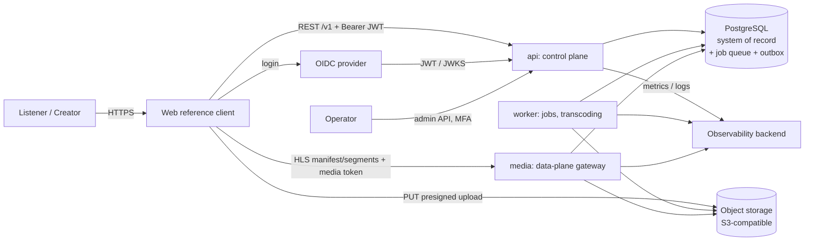

# System Context

- Status: Phase 3 (2026-10-04). Decisions: [ADR index](../adr/README.md).

## 1. Context diagram

## 2. Process roles (ADR-0001)

| Role | Plane | Responsibilities | Must not |
|---|---|---|---|
| `api` | control | AuthN/Z, policy decisions, metadata, upload intents, playback session issue, DIG, search, library, ops API | Serve audio bytes; decode media |
| `worker` | async | Validate, probe, transcode, waveform, loudness, deletion propagation, export packaging, search indexing, outbox dispatch | Accept inbound network traffic |
| `media` | data | Verify media token + session state, stream HLS bytes from media buckets | Make entitlement decisions beyond token/session validity |

## 3. External systems

| System | Purpose | Decision |
|---|---|---|
| OIDC provider | Identity, MFA | ADR-0009 (provider Proposed) |
| Object storage | Originals, derivatives, exports | ADR-0004 (provider Proposed) |
| CDN | Production byte delivery | ADR-0008 (Proposed) |
| Payment provider | Commercial Gate | ADR-0018 (Proposed) |
| Catalog / credits data supplier | Catalog metadata, credits, relations | Q02, OQ-DIG-06 (Legal) |

## 4. Trust boundaries

1. Client ↔ api: untrusted input; every field validated; ownership derived from token.
2. Client ↔ object storage: presigned PUT only into `rabit-quarantine` with server-chosen key, size cap and expiry.
3. Quarantine → worker: untrusted bytes; sniff, probe and decode in an isolated process (ADR-0007).
4. Client ↔ media: media token (≤ 60 s) + session state check on every request.
5. Operator ↔ api: separate role claim, MFA, audited.

## 5. Bounded contexts

See [domain-boundaries.md](domain-boundaries.md).
