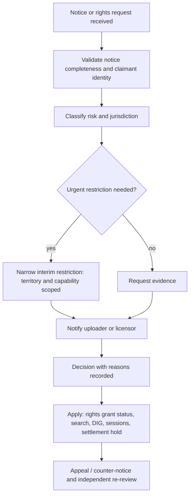

# Takedown Workflow (design)

- Status: Phase 8 (2026-10-04). Jurisdiction-specific deadlines and notice formats are **Legal** items; no single country's regime (e.g. DMCA) is used as a global default (AP-09).

## 1. Flow (AP-12 normalized)

## 2. Mapping to system mechanisms

| Step | Catalog content (MVP mechanisms) | Public UGC (P1) |
|---|---|---|
| Interim restriction | Suspend RightsGrant (`status=suspended`) → sessions revoked ≤ 60 s | Source visibility restriction (to be built) |
| Final removal | Revoke grant | Remove publication; keep private copy for uploader unless law requires otherwise |
| Scope | Per recording, territory, use — never whole-account private data (OPS-002) | Same |
| Records | Audit log entry with reason, actor, correlation | Case table (P1) |
| Purchasers | P1: decide re-download/refund impact per contract | — |

## 3. Abuse protections
Notices never auto-remove; reporter rate limits; false-notice records; claimant contact and evidence are not disclosed to the counter-party without legal basis.

## 4. Open items
Statutory deadlines, counter-notice formats, repeat-infringer thresholds, staffing and on-call (Q18).
